<div style="position: absolute; top: 10px; left: 10px;">
    
</div>

# **Slide Automation Tool Documentation**

## slide Automation Flow:


## Sections

- [Landscape](#landscape-section)
- [Pricing](#pricing-section)
- [PPA](#ppa-section)
- [Mix&amp;Assortment](#mixassortment-section)
- [Promotion](#promotion-section)
- [Financials](#Financials-section)
- [Pricing_CBC](#Pricing_CBC-section)
- [Innovation_CBC](#Innovation_CBC-section)

---

<div style="page-break-before: always;"></div>

## Extraction Data Part


### Example parameters

is setup defines various parameters for analyzing retail or market data related to client manufacturer, including product categories, financial settings, geographic regions, and time periods for analysis.

```python
f_name = os.path.join(os.path.dirname(os.getcwd()),"Sarantis Poland Dataset.xlsx")
client_manuf = ["Sarantis"]
client_brands = ["Jan Niezbedny", "Stella", "Anna Zaradna"]
decimals = 2
sign = "After"
currency = 'zł'
currency = ' '+ currency if sign.lower() == 'after' else  currency + ' '
categories = ["Garbage Bags"]
sectors = ["Draw Tape", "Wave Top", "Flat Top", "T-Shirt"]
segments = ["Scented", "No Scent"]
subsegments= ["0-20L", "21-35L", "36-60L", "61-120L", "121L And More"]
subcategories= []
national = True
customareas= ""
areas = ['NATIONAL',"CHANNEL"]
regions_RET  = []
channels_RET = []
market_RET = []
regions_CHAN = ["Discounters", "Drugstores", "Groceries", "Hyper/Super"]
channels_CHAN = ["Discounters", "Drugstores", "Groceries Large", "Groceries Medium", "Groceries Small", "Hypermarkets", "Supermarkets"]
market_CHAN = []
regions_CUST = []
channels_CUST = []
market_CUST = []
data_source = "DATA SOURCE: Trade Panel/Retailer Data | Ending Sep 2024"
years = ['2021', '2022','2023']
ManufOrTopC ="Top Companies"
```

### Open Excel

Example: This code opens Excel (Live Connection) and clear old data it has:

```python
f_path = Path.cwd()

excel = client.gencache.EnsureDispatch('Excel.Application')
excel.Visible = True  # False
wb = excel.Workbooks.Open(f_name)
ws=wb.Sheets([s.Name for s in wb.Sheets][0])
s_name = [s.Name for s in wb.Sheets][0]
## If changed we'll need to change the iloc's of the cleaning
pvtTable = ws.PivotTables(1)

#change report layout
pvtTable.RowAxisLayout(1)   #RowAxisLayout(1) for tabular form

#change pivot table style
#Select from Design tab, try out Medium9 or Medium3
pvtTable.TableStyle2 = "pivotStyleMedium21"
pvtTable.ClearTable()

pvtTable.TableRange2.Cut(ws.Range("A16"))

fieldsNamePosition={}
for i in range(1,pvtTable.CubeFields.Count+1):
    fieldsNamePosition[str(pvtTable.CubeFields(i))]=i
```

### Add Data in Excel

This code snippet processes and generates data related to market segments using pivot tables in Excel and stores the results as pickled DataFrames for later use. Here's a breakdown of the process:

1. **Initial Setup**:

   - **Dictionaries**: Two dictionaries, `sectors_dfs` and `sectors_P12M_dfs`, are defined to hold the DataFrames for segment data for different time periods.

   - Pivot Table Setup

     : A pivot table (

     ```
     pvtTable
     ```

     ) is prepared with row, column, filter, and value fields. These fields are:

     - **Rows**: `[Products].[Sector]`
     - **Columns**: `[Calendar].[Year]`
     - **Filters**: Multiple filters such as scope, category, market area, region, channel, and time period.
     - **Values**: A set of measures such as volume sales, value sales, price, growth contribution, etc.

2. **Pivot Table Calculation**:

   - The pivot table is cleared (`pvtTable.ClearTable()`) and then set up with the `set_excel_fields` function, which likely applies the field configurations to the pivot table.
   - The filter for `[Products].[Category]` is applied to select a category from the `categories` list.
   - The filter for `[Scope].[Scope]` is set to "Category", implying that the analysis will be focused on category-level data.

3. **Data Calculation for Different Time Periods**:

   - **P3Y (Past 3 Years)**: The pivot table is used to calculate data for segments by calling `calculate_category_data(sectors_dfs)` after setting the scope to "Category". This function likely processes and stores the results in `sectors_dfs`.
   - **P12M (Past 12 Months)**: The pivot table is adjusted to focus on the "P12M" time period, and `calculate_category_data(sectors_P12M_dfs)` is called to generate the results for the last 12 months, which are stored in `sectors_P12M_dfs`.

4. **Data Storage**:

   - The resulting DataFrames (

     ```
     sectors_dfs
     ```

      and 

     ```
     sectors_P12M_dfs
     ```

     ) are pickled (serialized) and saved as 

     ```
     .pickle
     ```

      files:

     - `sectors_dfs.pickle`: Stores the 3-year segment data.
     - `sectors_P12M_dfs.pickle`: Stores the 12-month segment data.

```python
# Dictionary of DataFrames
sectors_dfs = {}
sectors_P12M_dfs = {}
if len(sectors)!=0:

    row_list = ['[Products].[Sector]']
    column_list=['[Calendar].[Year]']
    filter_list=['[Scope].[Scope]','[Products].[Category]','[Market].[Area]','[Market].[Region]','[Market].[Channel]','[Market].[Market]','[Time Logic].[Time Period]']
    value_list=['[Measures].[Volume Sales]','[Measures].[Value Sales]','[Measures].[Volume Share]','[Measures].[Value Share]','[Measures].[Value Sales IYA]','[Measures].[Av Price/KG]','[Measures].[WoB %]','[Measures].[Relative Price]','[Measures].[Growth Contribution]','[Measures].[Volume Sales IYA]','[Measures].[IYA Price/KG]']

    pvtTable.ClearTable()
    pvtTable = set_excel_fields(row_list,column_list,filter_list,value_list,pvtTable)

    #Select the filter values for each filter
    pvtTable.PivotFields("[Products].[Category].[Category]").ClearAllFilters()
    pvtTable.PivotFields('[Products].[Category].[Category]').CurrentPageName = f'[Products].[Category].&[{categories[0]}]'

    # Segments Dataframes For P3Y For Area = NATIONAL, REGION, CHANNEL,CUSTOM

    pvtTable.PivotFields("[Scope].[Scope].[Scope]").ClearAllFilters()
    pvtTable.PivotFields('[Scope].[Scope].[Scope]').CurrentPageName = '[Scope].[Scope].&[Category]'

    calculate_category_data(sectors_dfs)

    # Segments Dataframes For P12M For Area = NATIONAL, REGION, CHANNEL,CUSTOM

    pvtTable.CubeFields(list(filter_dictionary_keys(fieldsNamePosition, '[Calendar].[Year]').values())[0]).Orientation = 0  

    pvtTable.PivotFields("[Time Logic].[Time Period].[Time Period]").ClearAllFilters()
    pvtTable.PivotFields('[Time Logic].[Time Period].[Time Period]').CurrentPageName = '[Time Logic].[Time Period].&[P12M]'

    calculate_category_data(sectors_P12M_dfs ) 


with open('Landscape Datasets/sectors_dfs.pickle', 'wb') as handle:
    pickle.dump(sectors_dfs, handle, protocol=pickle.HIGHEST_PROTOCOL)
    
with open('Landscape Datasets/sectors_P12M_dfs.pickle', 'wb') as handle:
    pickle.dump(sectors_P12M_dfs, handle, protocol=pickle.HIGHEST_PROTOCOL)
```

### Example : How Live Connection Work


### After data frame saved

we save many dataframes in dictionary and then use it in duplication part 


## Duplication Part


### Landscape Section

#### Introduction

In the slide automation landscape: from13 slide base we create 5 decks


1. Landscape Market(trend-Concent-growth)&ValAvgPrice Slides:

   - Market Trends Analysis
   - Market Concentration
   - Market growth contributors
   - Value Sales & Avg Price
2. Landscape ShareGrowth Slides:

   - Share and Growth by Manufacturer/Brands
   - Share and Growth By Manufacturer
   - Momentum Analysis
3. Landscape Category(Trend-Overview)Slides :

   * Category Trends
   * Share Evolution index analysis
   * Category Overview
4. Landscape Output WO CB Slides:

   * Market Trends Analysis
   * Market Concentration
   * Share and Growth by Manufacturer/Brands
   * Share and Growth By Manufacturer
5. Landscape RPVM Slides:

   * Revenue by Price vs. Volume vs. Mix analysis

---

#### Project Steps

- Project Flow
- 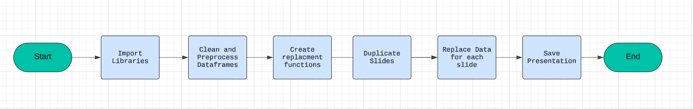

* [Step 1: Import Libraries we use](#step-1-import-libraries-we-use)
* [Step 2: modified Data frames: cleaning and preprocessing the data frames](#step-2-modified-data-frames)
* [Step 3: Write Functions to Create Slides: Define functions to Automatically generate slides based on the base slides](#step-3-write-functions-to-create-slides)
* [Step 4: Duplicate Slides: Use functions or methods to duplicate existing slides as needed for the presentation.](#step-4-duplicate-slides)
* [Step 5: Replace Data in Slides: update information from the cleaned data frames to slides](#step-5-replace-data-in-slides)
* [Step 6: Save Presentation](#step-6-save-presentation)

---

<div style="page-break-before: always;"></div>

##### [Step 1: Import Libraries we use ](https://github.com/khaledSeifEleslam/Slide-Automate/blob/main/general_functions/generalFunctions.ipynb)

###### Ex: Libraries we use

- This script sets up an environment for working with PowerPoint presentations, data manipulation, filesystem operations, and COM (Component Object Model) object access.
- It imports necessary modules such as 'pptx' for PowerPoint automation, 'win32com' for COM object access and Windows automation, 'pandas' and 'numpy' for data manipulation,
- 'pathlib' for working with filesystem paths, 're' for regular expression operations, and various other modules for general-purpose tasks like file operations and timing functions.
- By importing these modules, the script prepares itself for tasks such as creating or modifying PowerPoint presentations, analyzing data using pandas and numpy, interacting
- with the Windows environment using win32com, and performing filesystem operations using shutil and os. Overall, this script provides a comprehensive setup for automating tasks
- related to PowerPoint presentations and general-purpose Python programming.

```python
# Import necessary module for working with PowerPoint presentations
from pptx import Presentation
# Import the win32com.client module, aliasing it as win32 for convenience
import win32com.client as win32
# Import pandas for data manipulation and analysis
import pandas as pd
# Import numpy for numerical computing
import numpy as np
# Import the Path class from pathlib for working with filesystem paths
from pathlib import Path
# Import re for regular expression operations
import re
# Import sys for access to interpreter-related functions
import sys
# Import time for various time-related functions
import time
# Assign win32.constants to a shorter alias win32c for easier access
win32c = win32.constants
# Import shutil for high-level file operations
import shutil
# Import os for operating system dependent functionality
import os
# Import win32com.client again for COM object and functions access
import win32com.client
# Import warnings for warning control functionality
import warnings
```

---

##### [Step 2: modified Data frames](https://github.com/khaledSeifEleslam/Slide-Automate/blob/main/Landscape%20slide%20duplicate/Landscape%20duplicate.ipynb)

- This function takes a dictionary of dataframes and a category type as input.
- It iterates over each dataframe in the dictionary and performs cleaning operations,
- such as renaming columns, removing unwanted rows, converting data types, and
- separating totals from the main data. The cleaned dataframes and totals are
- stored in separate dictionaries. Finally, it returns two dictionaries:
- one containing cleaned sector segment data and the other containing totals.

###### Parameters:

- - inputdic: A dictionary of dataframes where each dataframe represents  data.

###### Returns:

- - outputdic: A dictionary containing cleaned sector segment dataframes for each sector.
- - totaloutputdic: A dictionary containing totals dataframes for each sector.

```python
def secsegclean(inputdic):
    outputdic={}
    totaloutputdic={}
    for s in inputdic.keys():
        t = inputdic[s].copy()
        t=DetectHeader(t).fillna(0)
        mod = t[(~t[t.columns[0]].astype(str).str.contains('Grand Total'))]
        mod = mod.sort_values([col for col in mod.columns if 'Value Share' in col], ascending=False)
        tot = t[(t[t.columns[0]].astype(str).str.contains('Grand Total'))]
        if not mod.empty:
            outputdic[s] = mod
        if not tot.empty:
            totaloutputdic[s] = tot
    return outputdic,totaloutputdic
```

---

###### Example: input dataframe before clean


###### Example: How to call the function & show the DataFrame output


---

##### [Step 3: Write Functions to Create Slides](https://github.com/khaledSeifEleslam/Slide-Automate/blob/main/general_functions/Landscape%20Replacement%20Function.ipynb)

---

To create slides we need some function
Example:Market Trends slides

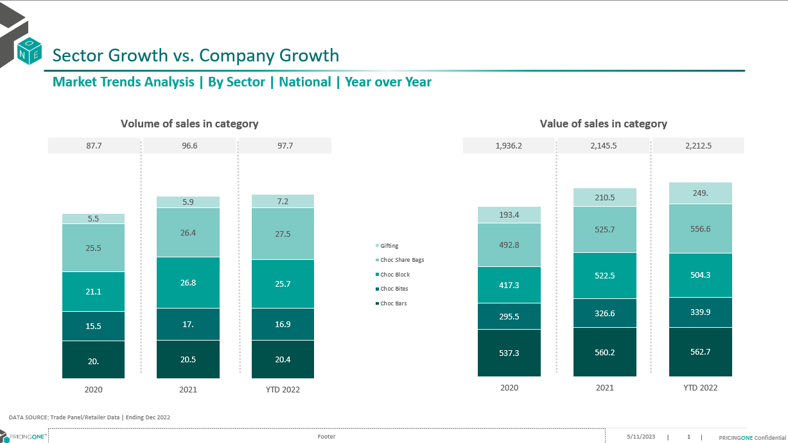

---

- [Totals_Table_Fill](https://github.com/khaledSeifEleslam/Slide-Automate/blob/main/Landscape%20slide%20duplicate/Landscape%20Replacement%20Function.ipynb): function populates a table on a slide with totals data from a specified dataframe. It formats the text in the cells, including font size, font name, and alignment.

  - It takes Parameters:
    table (Table): Table shape in the slide.
    list_duplicates (list): List of duplicate names for identifying slides.
    df_totals (dict): Dictionary of total DataFrames for each duplicate name.
    cols (list): Columns in the DataFrame.
    slidenum (int): Slide number.
  - Returns:
    Table: Updated table shape.

```python
def Totals_Table_Fill(table, list_duplicates, df_totals, cols, slidenum):
   
    for i, row in enumerate(table.rows):
        if i != 0:
            for j, cell in enumerate(row.cells):
                cell.text = str(round(df_totals[list_duplicates[slidenum]][cols].iloc[0, 1:4][j] / 1000000, 1 ))
                cell.text_frame.paragraphs[0].runs[0].font.size = Pt(10)
                cell.text_frame.paragraphs[0].runs[0].font.name = 'Nexa Book'
                cell.text_frame.paragraphs[0].alignment = PP_ALIGN.CENTER
    return table
```

- [Column_Chart_Fill](https://github.com/khaledSeifEleslam/Slide-Automate/blob/main/general_functions/Landscape%20Replacement%20Function.ipynb):function customizes a column chart on a slide by filling series with specific colors based on their names and adding formatted data labels to each point in the series
  - It takes Parameters:
    chart (Chart): Chart shape in the slide.
    scope (list): List of scope names.

```python

def Column_Chart_Fill(chart, scope):
   
    client_colors = [RGBColor(0, 80, 75), RGBColor(0, 108, 109), RGBColor(0, 160, 151), RGBColor(126, 202, 196), RGBColor(153, 199, 197), RGBColor(178, 223, 220)]
    gray_colors = [RGBColor(217, 217, 217), RGBColor(191, 191, 191), RGBColor(166, 166, 166), RGBColor(155, 152, 152), RGBColor(127, 127, 127)]

    for i, series in enumerate(chart.series):
        if series.name in scope:
            series.format.fill.solid()
            series.format.fill.fore_color.rgb = client_colors[i if i < len(client_colors) else -1]
        else:
            series.format.fill.solid()
            series.format.fill.fore_color.rgb = gray_colors[i if i < len(gray_colors) else -1]           
        for j, point in enumerate(series.points):
            data_label = point.data_label
            data_label.has_text_frame = True
            data_label.text_frame.text =  str(round(series.values[j], 1))
            data_label.text_frame.paragraphs[0].runs[0].font.color.rgb = RGBColor(255, 255, 255)
```

---

- [Markete_Trends function](https://github.com/khaledSeifEleslam/Slide-Automate/blob/main/Landscape%20slide%20duplicate/Landscape%20Replacement%20Function.ipynb), which automates the creation and updating of market trend analysis slides in a PowerPoint presentation. It fills the slides with charts and tables using data from provided dataframes. The function processes each slide based on a list of duplicate names, adding relevant data and formatting to charts and tables. It supports customization through parameters like position offset and slide grouping criteria. This function is useful for generating detailed, data-driven presentations on market trends, enhancing efficiency and consistency in reporting.

  - It takes Parameters:
    prs (Presentation): PowerPoint presentation object.
    list_duplicates (list): List of duplicate names for identifying slides.
    modified_df (dict): Dictionary of modified DataFrames for each duplicate name.
    df_totals (dict): Dictionary of total DataFrames for each duplicate name.
    scope (list): List of scope names.
    position (int, optional): Position offset for slides. Defaults to 0.
    slide_by (str, optional): Slide grouping criteria. Defaults to ''.

```python

def Market_Trends(prs, list_duplicates, modified_df, df_totals, scope, position=0, slide_by=''):
   
    for slidenum in range(len(list_duplicates)): 
        shapes = prs.slides[slidenum + position].shapes
        charts = []
        tables = []
        title = shapes.title.text
        shapes[4].text = data_source  
        shapes[5].text = f'Market Trends Analysis | By {slide_by} | ' + list_duplicates[slidenum] + ' | Year over Year'
        shapes[5].text_frame.paragraphs[0].font.bold = True
 
        for shape in shapes:
            if shape.has_chart:
                charts.append(shape)
            if shape.has_table:
                tables.append(shape)

        for chartnum in range(2):
            chart = charts[chartnum].chart
            table = tables[chartnum].table
            chart_data = CategoryChartData()
            chart_data.categories = ['2021', '2022', 'YTD 2023']
  
            volume_cols = [c for c in modified_df[list_duplicates[slidenum]].columns[modified_df[list_duplicates[slidenum]].columns.str.contains(f'{slide_by}|Volume Sales')]]
            value_cols = [c for c in modified_df[list_duplicates[slidenum]].columns[(modified_df[list_duplicates[slidenum]].columns.str.contains(f'{slide_by}|Value Sales')) & ~(modified_df[list_duplicates[slidenum]].columns.str.contains('IYA'))]]
  
            if chartnum == 0:  
                for i in range(modified_df[list_duplicates[slidenum]].shape[0]):
                    series_name = modified_df[list_duplicates[slidenum]][volume_cols].iloc[i, 0]
                    number = modified_df[list_duplicates[slidenum]][volume_cols].iloc[i, 1:4] / 1000000  
                    series = chart_data.add_series(series_name, number)
                    chart.replace_data(chart_data)
                    Column_Chart_Fill(chart, scope)
                Totals_Table_Fill(table, list_duplicates, df_totals, volume_cols, slidenum)
  
            elif chartnum == 1:
                value_cols = [c for c in modified_df[list_duplicates[slidenum]].columns[(modified_df[list_duplicates[slidenum]].columns.str.contains(f'{slide_by}|Value Sales')) & ~(modified_df[list_duplicates[slidenum]].columns.str.contains('IYA'))]]
                for i in range(modified_df[list_duplicates[slidenum]].shape[0]):
                    series_name = modified_df[list_duplicates[slidenum]][value_cols].iloc[i, 0]
                    number = modified_df[list_duplicates[slidenum]][value_cols].iloc[i, 1:4] / 1000000  
                    series = chart_data.add_series(series_name, number)
                    chart.replace_data(chart_data)
                    Column_Chart_Fill(chart, scope)
                Totals_Table_Fill(table, list_duplicates, df_totals, value_cols, slidenum)

```

---

##### [Step 4: Duplicate Slides](https://github.com/khaledSeifEleslam/Slide-Automate/blob/main/Landscape%20slide%20duplicate/Landscape%20duplicate.ipynb)

- prepares data and configurations for generating market analysis slides in a PowerPoint presentation. It creates index and duplication lists dynamically based on the presence of segment data and the number of data keys in various dictionaries. These lists are used to control the slide generation process. The script also defines a comprehensive list of section names for organizing slide titles, ensuring each slide is labeled appropriately based on its content. This setup allows for automated, consistent, and dynamic creation of market trend analysis slides, which is particularly useful for large presentations with multiple sections and varying data inputs.

```python
# This script prepares index and duplication lists for generating PowerPoint slides
# with various market trends and growth analysis. It dynamically adjusts based on the presence
# of segment data and compiles a list of section names for slide titles.
index = [
    *[0]*(2+(1 if sectors else 0)+(1 if segments else 0)+(1 if subcategories else 0)+(1 if subsegments else 0)),
           *[1]*(2+(1 if sectors else 0)+(1 if segments else 0)+(1 if subcategories else 0)+(1 if subsegments else 0)),
               *[2]*((1 if sectors else 0) +(1 if segments else 0)+(1 if subcategories else 0)+(1 if subsegments else 0)),
               *[2]*section_number,
               *[3]*((1 if sectors else 0) +(1 if segments else 0)+(1 if subcategories else 0)+(1 if subsegments else 0)),
             *[3]*section_number_Avg,
                ]
index=[i for i in index if i !=[]]

duplication_1 = [len(modified_manuf_dfs_new.keys()), len(modified_brands_share_new.keys()),len(modified_sectors_dfs_new.keys())if sectors else 0,len(modified_segment_dfs_new.keys())if segments else 0,len(modified_subsegment_dfs_new.keys())if subsegments else 0,len(modified_subcategories_dfs_new.keys())if subcategories else 0]
duplication_2 = [len(modified_manuf_dfs_new.keys()), len(modified_brands_share_new.keys()), len(modified_sectors_dfs_new.keys())if sectors else 0, len(modified_segment_dfs_new.keys())if segments else 0,len(modified_subsegment_dfs_new.keys())if subsegments else 0,len(modified_subcategories_dfs_new.keys())if subcategories else 0]
duplication_3 = [len(modified_sectors_P12M_new.keys()) if sectors else 0, len(modified_segment_P12M_new.keys())if segments else 0, len(modified_subsegment_P12M_new.keys())if subsegments else 0, len(modified_subcategories_P12M_new.keys())if subcategories else 0,*duplication_num]
duplication_4 = [len(modified_sectors_clients_new.keys())if sectors else 0,len(modified_segment_clients_new.keys())if segments else 0, len(modified_subsegment_clients_new.keys())if subsegments else 0, len(modified_subcategories_clients_new.keys())if subcategories else 0, *duplication_num_Avg]

duplication = duplication_1 + duplication_2  + duplication_3  + duplication_4
duplication = [item for item in duplication if item !=0]

section_names_slide1 = ["Market Trends by Manufacturer","Market Trends by Brands","Market Trends by Sectors"] + (["Market Trends by Segments"] if len(segments)>0 else [])+(["Market Trends by SubSegments"] if len(subsegments)>0 else [])+(["Market Trends by SubCategory"] if len(subcategories)>0 else [])
section_names_slide2 = ["Market Concentration By Manufacturer", "Market Concentration By Brands", "Market Concentration By Sectors"]+ (["Market Concentration By Segments"] if len(segments)>0 else [])+(["Market Concentration by SubSegments"] if len(subsegments)>0 else [])+(["Market Concentration by SubCategory"] if len(subcategories)>0 else [])
section_names_slide3 = (["Market Growth By Sectors"]if len(sectors)>0 else [])+(["Market Growth By Segments"]if len(segments)>0 else [])+(["Market Growth By SubSegments"]if len(subsegments)>0 else [])+(["Market Growth By SubCategory"]if len(subcategories)>0 else [])+[*section_name_Growth]
section_names_slide4 = (["Value Vs AvgPrice By Sectors"]if len(sectors)>0 else [])+(["Value Vs AvgPrice By Segments"]if len(segments)>0 else [])+(["Value Vs AvgPrice By SubSegments"]if len(subsegments)>0 else [])+(["Value Vs AvgPrice By SubCategory"]if len(subcategories)>0 else [])+[*section_name_Avg]


section_names = [ *section_names_slide1 ,*section_names_slide2,*section_names_slide3, *section_names_slide4               
                 ]
path = os.getcwd() + '\Landscape base.pptx'
new_pre = os.getcwd() + '\Landscape duplicate Market(Trends).pptx'

```
---
###### [Duplication Function](https://github.com/khaledSeifEleslam/Slide-Automate/blob/main/general_functions/generalFunctions.ipynb)

We use the duplication function to duplicate slides by number of the duplicate  and save it in the duplication deck to use it to replace data.
Duplicate slides in a PowerPoint presentation.
    Parameters:
    - index (list): List of slide indices to duplicate.
        - duplication (list): List specifying the number of times each slide should be duplicated.
        - section_names (list): List of names for sections to be added.
        - path (str): Path to the PowerPoint presentation file.
        - new_pre (str): Path to save the duplicated presentation.
        Returns:
        - str: A message indicating success or failure.

```python
####New_With_duplicate
import pythoncom
defslideDuplication(index=[0,1],duplication=[1,1],section_names=[''],path='',new_pre=''):
    lis=[]
    iflen(index)!=len(duplication)!=len(section_names):
        return'The Index list not equal the Duplication number list in length'
    app = win32.Dispatch("PowerPoint.Application")
    presentation = app.Presentations.Open(path)
    # Iterate through the slides in the original presentation and copy them to the new presentation
    for i inrange(len(index)):
        iftype(index[i])==list:
            # If index is a list of slide indices
            for num_duplicate inrange(duplication[i]):
                for k in index[i]:
                    slide=presentation.Slides[k]
                    duplicated_slide = slide.Duplicate()
                    duplicated_slide.MoveTo(presentation.Slides.Count)
            lis.append(presentation.Slides.count+1-(duplication[i]*len(index[i])))
        else:
            # If index is a single slide index
            slide=presentation.Slides[index[i]]
            for num_duplicate inrange(duplication[i]):
                duplicated_slide = slide.Duplicate()
                duplicated_slide.MoveTo(presentation.Slides.Count)
            lis.append(presentation.Slides.count+1-duplication[i])
    # Add sections to the new presentation
    for j inrange(len(lis)):
        if duplication[j]!=0:
            presentation.SectionProperties.AddBeforeSlide(lis[j],section_names[j] )
    # presentation.ApplyTheme(themePath)
    presentation.SectionProperties.Delete(1, True)
    presentation.SaveAs(new_pre)
    presentation.Close()
    # Close the original presentation and PowerPoint application
    app.Quit()
```
##### [Step 5: Replace Data in Slides](https://github.com/khaledSeifEleslam/Slide-Automate/blob/main/Landscape%20slide%20duplicate/Landscape%20duplicate.ipynb)

- This script uses the Market_Trends function to generate market trend analysis slides in a PowerPoint presentation for various categories such as Top Companies, Top Brands, Sectors, and Segments. It initializes a position counter p and increments it after each call to ensure the slides are added sequentially. The calculate_position function is used to determine the correct position for each set of slides, allowing for dynamic and organized slide generation based on the provided data dictionaries and scope lists. This approach enables efficient creation of comprehensive market analysis presentations.

```python

#  calls the Market_Trends function to generate PowerPoint slides
# for different categories (Top Companies, Top Brands, Sector, Segment) and
# updates the position variable for each call to ensure slides are generated in the correct order.

p=0
Market_Trends(prs, list(modified_manuf_dfs_new.keys()), modified_manuf_dfs_new, modified_manuf_totals_new, client_manuf ,position = calculate_position(p), slide_by = 'Top Companies')
p+=1
Market_Trends(prs, list(modified_brands_share_new.keys()), modified_brands_share_new, modified_brands_totals_new, client_brands ,position =calculate_position(p), slide_by = 'Top Brands')
p+=1
Market_Trends(prs, list(modified_sectors_dfs_new.keys()), modified_sectors_dfs_new, sectors_totals_new, sectors ,position = calculate_position(p), slide_by = 'Sector')
p+=1
if len(segments)!=0:
    Market_Trends(prs, list(modified_segment_dfs_new.keys()), modified_segment_dfs_new, segment_totals_new, segments ,position = calculate_position(p), slide_by = 'Segment')
    p+=1
```

---
<div style="page-break-before: always;"></div>

##### [Step 6: Save Presentation](https://github.com/khaledSeifEleslam/Slide-Automate/blob/main/Landscape%20slide%20duplicate/Landscape%20duplicate.ipynb)

- performs two main tasks: saving the current PowerPoint presentation to a file and opening that file using the PowerPoint application. The outputPath variable is constructed using the current working directory, ensuring the presentation is saved in the correct location. After saving the presentation, the script uses win32com.client to dispatch the PowerPoint application and open the saved presentation. This automation allows for seamless transition from generating the presentation to viewing or editing it in PowerPoint, streamlining the workflow for creating market analysis slides.

```python
# This script saves the generated PowerPoint presentation to a specified path
# and then opens the saved presentation using the PowerPoint application.

# Define the output path for the PowerPoint presentation
outputPath = os.getcwd() + "\\Landscape output.pptx"

# Save the PowerPoint presentation to the specified output path
prs.save(outputPath)

# Initialize the PowerPoint application using win32com client
app = win32.Dispatch("PowerPoint.Application")

# Open the saved PowerPoint presentation
presentation = app.Presentations.Open(outputPath)
```

---

##### Ex:Market Trends Slide OutPut After Replacement Data


<div style="page-break-before: always;"></div>

### Pricing  Section

#### Introduction

In the slide automation pricing : from12 slide base we create 5 decks


1. Pricing Output Slides:

   - Price Positioning Analysis
   - Share and Growth By Brands(**Leadership Table**)
   - Value Sales Vs Avg Price
2. Pricing  Avg&Shelf Price Output Slides:

   - Avg Price/Vol
   - Shelf Price/Vol
3. Pricing Price Point Output Slides :

   * Price Point Distribution Analysis by product
   * Price Point Comparison Analysis by Product
   * Price Point Distribution Analysis by brand
   * Price Point Distribution by brand by Sector
4. Pricing Correlation Output Slides:

   * Price Correlation Analysis P3Y
   * Price Correlation Analysis P12M
5. Pricing not_forcing_CB_Output Slides

   * Price Positioning Analysis
   * Share and Growth By Brands(**Leadership Table**)
   * Price Point Distribution Analysis by brand

---

#### Project Steps

- Project Flow
  

* [Step 1: Import Libraries we use](#step-1-import-libraries)
* [Step 2: modified Data frames: cleaning and preprocessing the data frames](#step-2-modified-data-frame)
* [Step 3: Write Functions to Create Slides: Define functions to dynamically generate slides based on the base slides](#step-3-write-functions-to-create-slide)
* [Step 4: Duplicate Slides: Use functions or methods to duplicate existing slides as needed for the presentation.](#step-4-duplicate-slides)
* [Step 5: Replace Data in Slide: update information from the cleaned data frames to slides](#step-5-replace-data-in-slide)
* [Step 6: Save Presentation](#step-6-save-presentation)

---

##### [Step 1: Import Libraries we use ](https://github.com/khaledSeifEleslam/Slide-Automate/blob/main/general_functions/generalFunctions.ipynb)

##### Ex: Libraries we use

- This script sets up an environment for working with PowerPoint presentations, data manipulation, filesystem operations, and COM (Component Object Model) object access.
- It imports necessary modules such as 'pptx' for PowerPoint automation, 'win32com' for COM object access and Windows automation, 'pandas' and 'numpy' for data manipulation,
- 'pathlib' for working with filesystem paths, 're' for regular expression operations, and various other modules for general-purpose tasks like file operations and timing functions.
- By importing these modules, the script prepares itself for tasks such as creating or modifying PowerPoint presentations, analyzing data using pandas and numpy, interacting
- with the Windows environment using win32com, and performing filesystem operations using shutil and os. Overall, this script provides a comprehensive setup for automating tasks
- related to PowerPoint presentations and general-purpose Python programming.

```python
# Import necessary module for working with PowerPoint presentations
from pptx import Presentation
# Import the win32com.client module, aliasing it as win32 for convenience
import win32com.client as win32
# Import pandas for data manipulation and analysis
import pandas as pd
# Import numpy for numerical computing
import numpy as np
# Import the Path class from pathlib for working with filesystem paths
from pathlib import Path
# Import re for regular expression operations
import re
# Import sys for access to interpreter-related functions
import sys
# Import time for various time-related functions
import time
# Assign win32.constants to a shorter alias win32c for easier access
win32c = win32.constants
# Import shutil for high-level file operations
import shutil
# Import os for operating system dependent functionality
import os
# Import win32com.client again for COM object and functions access
import win32com.client
# Import warnings for warning control functionality
import warnings
```

---

##### [Step 2: modified Data frame](https://github.com/khaledSeifEleslam/Slide-Automate/blob/main/Pricing%20slide%20duplicate/Pricing%20duplicate.ipynb)

###### EX: input dataframes before cleaning

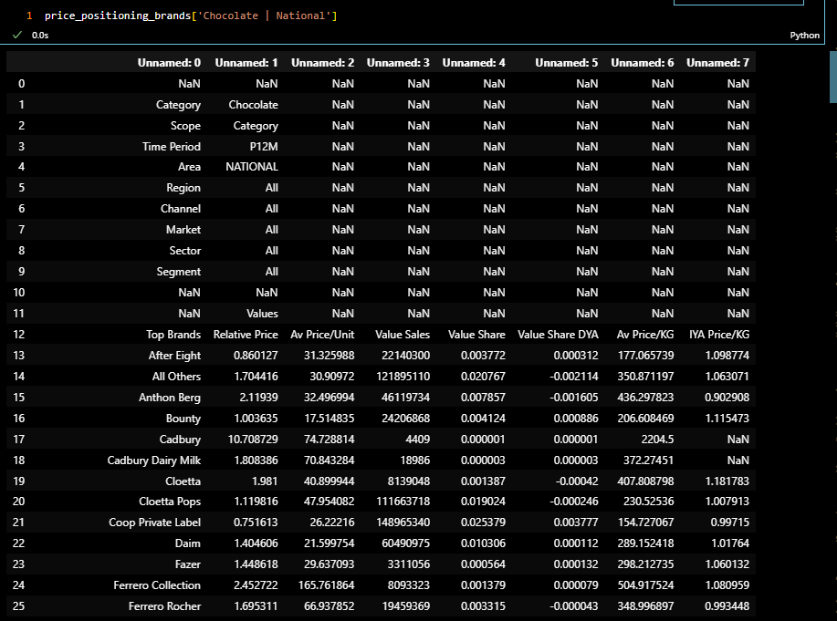

---

###### cleaning Code

- This code processes a dictionary of DataFrames, modified_price_positioning_sorted, by performing a series of operations on each DataFrame. Specifically, it iterates over each key in the dictionary, makes a copy of the DataFrame to avoid altering the original, filters out rows where the 'Top Brands' column has the value 'Others', replaces all NaN values with 0, and then updates the dictionary with the modified DataFrame. This ensures that the DataFrames only include data from specified brands and that missing values are handled appropriately.

```Python
# Iterate over each key in the dictionary 'modified_price_positioning_sorted'
for k in modified_price_positioning_sorted.keys():
    
    # Create a copy of the DataFrame associated with the current key to avoid modifying the original data
    df = modified_price_positioning_sorted[k].copy()
    
    # Filter out rows where the 'Top Brands' column has the value 'Others'
    df = df[df['Top Brands'] != 'Others']
    
    # Replace all NaN values in the DataFrame with 0
    df = df.replace(np.nan, 0)
    
    # Update the dictionary with the modified DataFrame
    modified_price_positioning_sorted[k] = df

```

###### Data frame after cleaning


##### [Step 3: Write Functions to Create Slide](https://github.com/khaledSeifEleslam/Slide-Automate/blob/main/general_functions/Pricing%20Replacement%20Function.ipynb)
###### Example slide : Price Positioning Analysis Slide
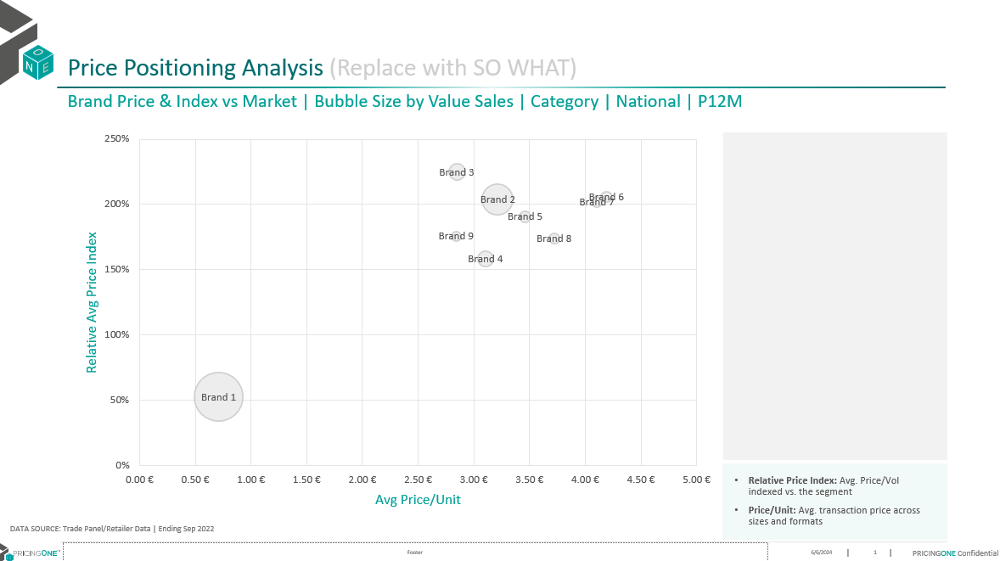

- [PricePositioning Function](https://github.com/khaledSeifEleslam/Slide-Automate/blob/main/general_functions/Pricing%20Replacement%20Function.ipynb): generates slides for a PowerPoint presentation, focusing on price positioning analysis with bubble chart visualizations. It iterates through a specified number of slides (numOfDuplicates)
  - parameters :
    prs: PowerPoint presentation object.
    modified_price_positioning_sorted: Dictionary containing sorted price positioning dataframes.
    numOfDuplicates: Number of duplicate slides to generate.
    position: Position index to start adding slides (default is 0).
```python
def pricePositioning(prs,modified_price_positioning_sorted,numOfDuplicates,position=0):
    for slidenum in range(numOfDuplicates):
        # Extract market and corresponding dataframe
        market=list(modified_price_positioning_sorted.keys())[slidenum]
        df=modified_price_positioning_sorted[market].reset_index(drop=True)
        # Access shapes in the slide
        shapes = prs.slides[slidenum+position].shapes
        charts = []
        tables = []
        title = shapes.title.text
        # Update text boxes in the slide
        shapes[4].text = data_source
        shapes[5].text = 'Brand Price & Index vs Market | Bubble Size by Value Sales | '+market+' | P12M'
        shapes[5].text_frame.paragraphs[0].font.bold = True

        for shape in shapes:
            if shape.has_chart:
                shape_id = shape.shape_id
                charts.append(shape)
        chart = charts[0].chart
        charts[0].left = Inches(0.57) # Adjust left position
        chart_name = charts[0].name
        chart_type = chart.chart_type
        # Add bubble chart data
        chart_data = BubbleChartData()
        chart_data.categories = df['Av Price/Unit'].unique().tolist()
        series = chart_data.add_series("Relative Price Index")
        series.has_data_labels = True
  
        # Add data points to the bubble chart
        for i in range(df.shape[0]):
            series.add_data_point(df['Av Price/Unit'].iloc[i], df['Relative Price'].iloc[i], df['Value Sales'].iloc[i])
        chart.replace_data(chart_data)
  
        # Update chart formatting
        xlsx_file=BytesIO()
        with chart_data._workbook_writer._open_worksheet(xlsx_file) as (workbook, worksheet):
            chart_data._workbook_writer._populate_worksheet(workbook, worksheet)
            worksheet.write(0, 4, "labels")
            worksheet.write_column(1, 4, df['Top Brands'], None)

        chart._workbook.update_from_xlsx_blob(xlsx_file.getvalue())

        category_axis = chart.category_axis
        if sign == 'Before':
            category_axis.tick_labels.number_format = f'{currency}#,##0.00'  if decimals == 2 else f'{currency}#,##0'
        else:
            category_axis.tick_labels.number_format = f'#,##0.00{currency}'  if decimals == 2 else f'#,##0{currency}'
  
        category_axis.auto_axis = True
  
        value_axis = chart.value_axis
        value_axis.tick_labels.number_format = '0%'
        value_axis.auto_axis = True
  
        # Customize data labels for each point in the chart
        for i,point in enumerate(chart.series[0].points):
            if df['Top Brands'].iloc[i]=="Others":
                point.format.fill.background()
                point.data_label.text_frame.text=''
                point.format.line.width = Pt(0)

            else:

                data_label = point.data_label
                data_label.has_text_frame=True
                data_label.text_frame.text=df['Top Brands'].iloc[i]
                data_label.text_frame.paragraphs[0].runs[0].font.size = Pt(10)
                data_label.position = XL_LABEL_POSITION.CENTER
                point.format.fill.solid()
                point.format.fill.fore_color.rgb = RGBColor(245,245,245)
                point.format.line.color.rgb = RGBColor(207,206,206)  # Set the desired RGB color value
                point.format.line.width = Pt(1)
```

---

##### [Step 4: Duplicate Slides](https://github.com/khaledSeifEleslam/Slide-Automate/blob/main/Pricing%20slide%20duplicate/Pricing%20duplicate.ipynb)

- This code is preparing data and configurations for generating a PowerPoint presentation with multiple sections, each requiring a different number of slides based on various price and distribution analyses. It includes:

  * Index List: Specifies the starting slide positions for different sections.
  * Duplication List: Indicates the number of slides to be generated for each section, based on the length of different datasets.
  * Section Names: Provides names for each section in the presentation.
  * Paths: Defines the file paths for the base PowerPoint template and the new duplicated presentation.

```python
# Define the index list for slide positions
index = [0, 1, 2, 3, 4, 3, 4, 5, 5, 5, 5, 5, 5, 6, 7, 7]

# Define the duplication list representing the number of slides to be generated for each section
duplication = [
    len(modified_price_positioning_sorted.keys()),  # Number of price positioning slides
    len(modified_brands_segments_leadership.keys()),  # Number of segments leadership slides
    len(modified_brands_sector_leadership.keys()),  # Number of sectors leadership slides
    len(all_brands_sector.keys()),  # Number of sector avg price/vol comparison slides
    len(all_brands_sector.keys()),  # Number of sector shelf price/vol comparison slides
    len(all_brands_segment.keys()),  # Number of segment avg price/vol comparison slides
    len(all_brands_segment.keys()),  # Number of segment shelf price/vol comparison slides
    len(sectorP3mPD.keys()),  # Number of category price point distribution analysis P3M slides
    len(sectorP12mPD.keys()),  # Number of category price point distribution analysis P12M slides
    len(segmentP3mPD.keys()),  # Number of sector price point distribution analysis P3M slides
    len(segmentP12mPD.keys()),  # Number of sector price point distribution analysis P12M slides
    len(sub_segmentP3mPD.keys()),  # Number of segment price point distribution analysis P3M slides
    len(sub_segmentP12mPD.keys()),  # Number of segment price point distribution analysis P12M slides
    len(modified_brandPriceDistribution.keys()),  # Number of price point distribution analysis by brand slides
    len(modified_sectorsPriceDistribution.keys()),  # Number of price point distribution by brand by sector slides
    len(modified_segmentPriceDistribution.keys())  # Number of price point distribution by brand by segment slides
]

# Define the section names to be used in the presentation
section_names = [
    "Price Positioning Analysis",
    "Segments Leadership Analysis",
    "Sectors Leadership Analysis",
    "Sector Avg Price/Vol Comparison",
    "Sector Shelf Price/Vol Comparison",
    "Segment Avg Price/Vol Comparison",
    "Segment Shelf Price/Vol Comparison",
    "Category Price Point Distribution Analysis P3M",
    "Category Price Point Distribution Analysis P12M",
    "Sector Price Point Distribution Analysis P3M",
    "Sector Price Point Distribution Analysis P12M",
    "Segment Price Point Distribution Analysis P3M",
    "Segment Price Point Distribution Analysis P12M",
    "Price Point Distribution Analysis By Brand",
    "Price Point Distribution By Brand By Sector",
    "Price Point Distribution By Brand By Segment"
]

# Define paths for the base PowerPoint template and the new duplicated presentation
path = os.getcwd() + '\Pricing slide base.pptx'
new_pre = os.getcwd() + '\Pricing duplicated.pptx'
```
---
###### [Duplication Function](https://github.com/khaledSeifEleslam/Slide-Automate/blob/main/general_functions/generalFunctions.ipynb)

We use the duplication function to duplicate slides by number of the duplicate  and save it in the duplication deck to use it to replace data.
Duplicate slides in a PowerPoint presentation.
    Parameters:
    - index (list): List of slide indices to duplicate.
    - duplication (list): List specifying the number of times each slide should be duplicated.
    - section_names (list): List of names for sections to be added.
    - path (str): Path to the PowerPoint presentation file.
    - new_pre (str): Path to save the duplicated presentation.
    Returns:
    - str: A message indicating success or failure.
```python
####New_With_duplicate
import pythoncom
defslideDuplication(index=[0,1],duplication=[1,1],section_names=[''],path='',new_pre=''):
    lis=[]
    iflen(index)!=len(duplication)!=len(section_names):
        return'The Index list not equal the Duplication number list in length'
    app = win32.Dispatch("PowerPoint.Application")
    presentation = app.Presentations.Open(path)
    # Iterate through the slides in the original presentation and copy them to the new presentation
    for i inrange(len(index)):
        iftype(index[i])==list:
            # If index is a list of slide indices
            for num_duplicate inrange(duplication[i]):
                for k in index[i]:
                    slide=presentation.Slides[k]
                    duplicated_slide = slide.Duplicate()
                    duplicated_slide.MoveTo(presentation.Slides.Count)
            lis.append(presentation.Slides.count+1-(duplication[i]*len(index[i])))
        else:
            # If index is a single slide index
            slide=presentation.Slides[index[i]]
            for num_duplicate inrange(duplication[i]):
                duplicated_slide = slide.Duplicate()
                duplicated_slide.MoveTo(presentation.Slides.Count)
            lis.append(presentation.Slides.count+1-duplication[i])
    # Add sections to the new presentation
    for j inrange(len(lis)):
        if duplication[j]!=0:
            presentation.SectionProperties.AddBeforeSlide(lis[j],section_names[j] )
    # presentation.ApplyTheme(themePath)
    presentation.SectionProperties.Delete(1, True)
    presentation.SaveAs(new_pre)
    presentation.Close()
    # Close the original presentation and PowerPoint application
    app.Quit()
```

##### [Step 5: Replace Data in Slide](https://github.com/khaledSeifEleslam/Slide-Automate/blob/main/Pricing%20slide%20duplicate/Pricing%20duplicate.ipynb)

- This part of the code calls the pricePositioning function to generate slides for the "Price Positioning Analysis" section of the presentation. It uses the prs PowerPoint presentation object, the dictionary modified_price_positioning_sorted containing the sorted price positioning dataframes, and the first element of the duplication list to determine the number of slides to generate. The position variable is set to 0, indicating that the slides should be added starting from the first position.

```python
# Set the initial position for slide insertion to 0
position = 0

# Call the pricePositioning function to generate slides for price positioning analysis
pricePositioning(prs, modified_price_positioning_sorted, duplication[0], position)

```
<div style="page-break-before: always;"></div>

##### [Step 6: Save Presentation](https://github.com/khaledSeifEleslam/Slide-Automate/blob/main/Pricing%20slide%20duplicate/Pricing%20duplicate.ipynb)

- This code is responsible for finalizing the creation of a PowerPoint presentation by saving it to a specified file path and then opening it using Microsoft PowerPoint. Initially, it defines the output path for the new PowerPoint presentation by combining the current working directory with the filename Pricing output.pptx. The script then saves the modified presentation (prs object) to this specified path. After saving, it uses the win32com.client.Dispatch method to create an instance of the PowerPoint application, and then it opens the saved presentation within this application. This process ensures that the newly created presentation is both saved and immediately available for viewing or further editing in Microsoft PowerPoint.

```python
# Define the output path for the new PowerPoint presentation
outputPath = os.getcwd() + "\\Pricing output.pptx"

# Save the modified presentation to the specified output path
prs.save(outputPath)

# Open the saved PowerPoint presentation using the PowerPoint application
app = win32.Dispatch("PowerPoint.Application")
presentation = app.Presentations.Open(outputPath)
```

---

###### Example: OutPut Slide After Replacement Data "PricePositioning Slide OutPut"

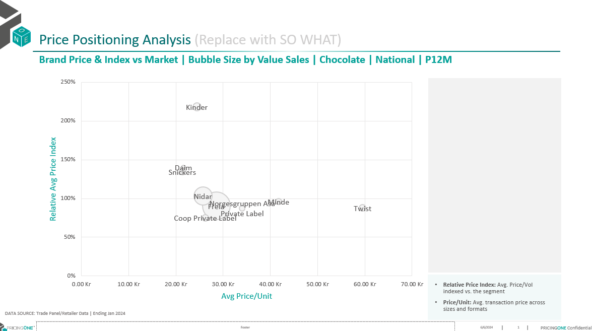

---

<div style="page-break-before: always;"></div>

### PPA  Section

#### Introduction

In the slide automation PPA: from 5 slide base we create 4 decks

Ex:columnName = ['Base Price Bracket',"Size Bracket","Portion Count Bracket"]

1. #ColumnName SLIDE 1output Slides:

   * Brand Share Topline
2. #ColumnName SLIDE 2-3output Slides:

   * #ColumnName by Sector/Segment
3. #ColumnName Slide4-5 output Slides:

   * Brackets Analysis By Sector
   * BracketsAnalysis By Segment
4. ISD output Slides :

   * Inter-size
     Discount Analysis

---

#### Project Steps

- Project Flow
  

* [Step 1: Import Libraries we use](#step-1-import-libraries)
* [Step 2: modified Data frames: cleaning and preprocessing the data frames](#step-2-modified-data-frame)
* [Step 3: Write Functions to Create Slides: Define functions to dynamically generate slides based on the base slides](#step-3-write-functions-to-create-slide)
* [Step 4: Duplicate Slides: Use functions or methods to duplicate existing slides as needed for the presentation.](#step-4-duplicate-slides)
* [Step 5: Replace Data in Slide: update information from the cleaned data frames to slides](#step-5-replace-data-in-slide)
* [Step 6: Save Presentation](#step-6-save-presentation)

---

##### [Step 1: Import Libraries we use ](https://github.com/khaledSeifEleslam/Slide-Automate/blob/main/general_functions/generalFunctions.ipynb)

###### Ex: Libraries we use

- This script sets up an environment for working with PowerPoint presentations, data manipulation, filesystem operations, and COM (Component Object Model) object access.
- It imports necessary modules such as 'pptx' for PowerPoint automation, 'win32com' for COM object access and Windows automation, 'pandas' and 'numpy' for data manipulation,
- 'pathlib' for working with filesystem paths, 're' for regular expression operations, and various other modules for general-purpose tasks like file operations and timing functions.
- By importing these modules, the script prepares itself for tasks such as creating or modifying PowerPoint presentations, analyzing data using pandas and numpy, interacting
- with the Windows environment using win32com, and performing filesystem operations using shutil and os. Overall, this script provides a comprehensive setup for automating tasks
- related to PowerPoint presentations and general-purpose Python programming.

```python
# Import necessary module for working with PowerPoint presentations
from pptx import Presentation
# Import the win32com.client module, aliasing it as win32 for convenience
import win32com.client as win32
# Import pandas for data manipulation and analysis
import pandas as pd
# Import numpy for numerical computing
import numpy as np
# Import the Path class from pathlib for working with filesystem paths
from pathlib import Path
# Import re for regular expression operations
import re
# Import sys for access to interpreter-related functions
import sys
# Import time for various time-related functions
import time
# Assign win32.constants to a shorter alias win32c for easier access
win32c = win32.constants
# Import shutil for high-level file operations
import shutil
# Import os for operating system dependent functionality
import os
# Import win32com.client again for COM object and functions access
import win32com.client
# Import warnings for warning control functionality
import warnings
```

---

##### [Step 2: modified Data frame](https://github.com/khaledSeifEleslam/Slide-Automate/blob/main/PPA%20slide%20duplicate/PPA%20Duplicate.ipynb)

###### EX: input dataframes before cleaning


---

##### Cleaning Data Frame

- This code is part of a data processing pipeline for cleaning and preparing bracket-related data. It selects the appropriate DataFrame based on columnName, processes elements in a brackets list, and iterates over ppaDf keys to rename columns, remove rows, forward-fill missing values, replace NaNs, and sort by 'Value Share'. Cleaned DataFrames are stored in ToplineBracket. The script methodically handles data preparation, crucial for accurate analysis and reporting, but the use of brackets and commented-out lines suggest the code may still be in development or require additional context.

```python
def process_bracket_data(dic,col="Base Price Bracket",bymanuf=False):
    ToplineBracket_brand = {}
    for key in dic.keys():
        df = dic[key].copy()
        df=DetectHeader(df)
        df=df[:-1]
        if col== "Base Price Bracket":
            df= df.rename(columns={"Base Price\xa0Bracket":"Base Price Bracket"})
        df[col] = df[col].ffill()
        if bymanuf:
            df[["Value Share"	,"Company WoB %"	,"Value Sales IYA"	,"Relative Price"]] = df[["Value Share"	,"Company WoB %"	,"Value Sales IYA"	,"Relative Price"]].replace(np.nan, 0).astype(float)
            if ManufOrTopC == "Manufacturer": df= df.rename(columns={"Manufacturer":"Top Companies"})
        else: 
            df[["Value Share"	,"Brand WoB %"	,"Value Sales IYA"	,"Relative Price"]] = df[["Value Share"	,"Brand WoB %"	,"Value Sales IYA"	,"Relative Price"]].replace(np.nan, 0).astype(float)
            if BrandOrTopB == "Brand": df= df.rename(columns={"Brand":"Top Brands"})
        df = df.sort_values('Value Share', ascending=False)
        df=df[~(df[col].str.contains('0-0'))]
        if df.shape[0]==0:
            print(key)
        else:
            ToplineBracket_brand[key] = df

    return ToplineBracket_brand        
```

---

##### Data Frame After cleaning


---

#### [Step 3: Write Functions to Create Slides](https://github.com/khaledSeifEleslam/Slide-Automate/blob/main/general_functions/PPA%20Replacement%20Function.ipynb)

##### Example slide : Brand Share Topline By Size Bracket

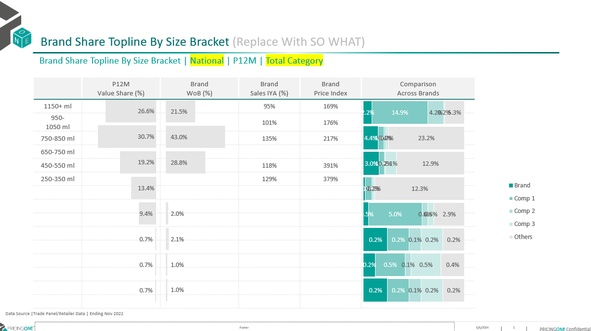

---

- [brandShareToplin](https://github.com/khaledSeifEleslam/Slide-Automate/blob/main/general_functions/PPA%20Replacement%20Function.ipynb)function:Generate a PowerPoint slide presentation with data visualizations and tables showing brand share topline metrics by various brackets for a specified number of slides.
  - Parameters:
    prs (pptx.presentation.Presentation): The PowerPoint presentation object where slides will be added or modified.
    modifiedShareToplineBracket (dict): Dictionary containing data frames for different markets.
    bracketsValue (list): List of size brackets to be considered.
    clientElement (str): Name of the client brand to highlight in the presentation.

```python
def brandShareTopline(prs, modifiedShareToplineBracket, bracketsValue, numOfDuplicates, slide_by, clientElement, position=0):  
    for slidenum in range(numOfDuplicates):
        # Get the market name and its corresponding data frame
        market = list(modifiedShareToplineBracket.keys())[slidenum]
        df = modifiedShareToplineBracket[market].copy()
        # Extract and sort 'Size' from the slide_by column
        df['Size'] = df[f"{slide_by}"].apply(lambda x: x.split('-')[1].split(' ')[0] if '-' in x else 9999).astype(float)
        df = df.sort_values(by=['Size'], ascending=False)  
        # Filter total brand data and clean up column values
        dfTotalBrand = df[df[f"{slide_by}"].str.contains('Total')]
        dfTotalBrand[f"{slide_by}"] = dfTotalBrand[f"{slide_by}"].str.replace(' Total', '')
        dfTotalBrand = dfTotalBrand[dfTotalBrand['Value Share'] > .01]
  
        # Filter the main data frame based on size
        df = df[df['Size'].isin(dfTotalBrand['Size'].unique())].sort_values(by='Value Share', ascending=False)
  
        # Get the top 3 brands excluding the client element
        dfTopSales = df[(df['Top Brands'].notna()) & (df['Top Brands'] != clientElement)].drop_duplicates(subset='Top Brands')['Top Brands'].iloc[:3].to_list()
        dfBrandInScope = df[df['Top Brands'].isin(dfTopSales)]
  
        # Calculate the 'Other' category for the data frame
        dfOther = df[(~df['Top Brands'].isin(dfTopSales + [clientElement])) & (~df[f"{slide_by}"].str.contains('Total'))].groupby([f"{slide_by}", 'Size'])['Value Share'].sum().reset_index().sort_values(by='Size', ascending=False)
        missingOtherBracket = list(set(bracketsValue) - set(dfTotalBrand[f"{slide_by}"].unique()))
        missingOtherBracket = pd.DataFrame({f"{slide_by}": missingOtherBracket, 'Size': [float(x.split('-')[1].split(' ')[0]) if '-' in x else 9999 for x in missingOtherBracket]})
        dfOther = pd.concat([dfOther, missingOtherBracket]).sort_values(by='Size', ascending=False)
        dfTotalBrand = pd.concat([dfTotalBrand, missingOtherBracket]).sort_values(by='Size', ascending=False)
  
        # Filter the client's brand data
        dfClientBrand = df[df['Top Brands'] == clientElement]
  
        # Access slide shapes to update text and formatting
        shapes = prs.slides[slidenum + position].shapes
        shapes[4].text = data_source
        shapes[5].text = f'Brand Share Topline By {slide_by} | {market} | P12M'
        # Format text as bold and set font size
        shapes[5].text_frame.paragraphs[0].font.bold = True
        for p in range(len(shapes[5].text_frame.paragraphs)):
            shapes[5].text_frame.paragraphs[p].font.size = Pt(12)
        shapes[6].text_frame.paragraphs[0].runs[0].text = shapes[6].text_frame.paragraphs[0].runs[0].text.replace('Size Bracket', slide_by)
        shapes[6].text_frame.paragraphs[0].font.size = Pt(16)
        # Create tables and charts
        tables, charts = createTableAndChart(shapes)
        # Adjust table row numbers
        table = tables[0].table
        num_rows_to_remove = len(table.rows) - dfTotalBrand[f"{slide_by}"].nunique() - 1
        for _ in range(num_rows_to_remove):
            if len(table.rows) > 1:  # Skip removing the first row if there is more than one row
                row = table.rows[1]
                remove_row(table, row)
        # Set table row height
        table_height = Inches(3.81)  # Specify the desired table height
        total_row_height = table_height - table.rows[0].height
        num_rows = len(table.rows) - 1  # Exclude the first row
        if num_rows > 0:
            cell_height = total_row_height / num_rows
            for row in range(1, len(table.rows)):
                table.rows[row].height = int(cell_height)
  
        # Replace the table data
        for i, row in enumerate(table.rows):
            for j, cell in enumerate(row.cells):
                if i == 0:
                    # Update header cells
                    if j in [2, 3, 4]:
                        cell.text = cell.text.replace('Brand', clientElement)
                        for paragraph in cell.text_frame.paragraphs:
                            paragraph.font.name = 'Nexa Bold'
                            paragraph.font.size = Pt(9)
                            paragraph.alignment = PP_ALIGN.CENTER
                            paragraph.font.color.rgb = RGBColor(87, 85, 85)
                            paragraph.font.bold = False
                    continue
                # Update data cells
                sizeBracket = dfTotalBrand[f"{slide_by}"].unique()[i - 1]
                if j == 0:
                    cell.text = sizeBracket
                    cell.text_frame.paragraphs[0].font.name = 'Nexa Bold'
                    cell.text_frame.paragraphs[0].font.size = Pt(9)
                    cell.text_frame.paragraphs[0].alignment = PP_ALIGN.CENTER
                if j == 3 or j == 4:
                    if j == 3:
                        value = dfClientBrand[dfClientBrand[f"{slide_by}"] == sizeBracket]['Value Sales IYA'].unique()
                        # Exclude Brand 'Brand WoB %' < 5%
                        if value and dfClientBrand[dfClientBrand[f"{slide_by}"] == sizeBracket]['Brand WoB %'].unique()[0] < .0005:
                            value = [0]
                        cell.text = '' if (len(value) == 0) or (int(round(float(value[0]) * 100, 0)) == 0) else (str(int(round(float(value[0]) * 100, 0))) + '%' if int(round(float(value[0]) * 100, 0)) <= 1000 else 'Large')
                    else:
                        value = dfClientBrand[dfClientBrand[f"{slide_by}"] == sizeBracket]['Relative Price'].unique()
                        # Exclude Brand 'Brand WoB %' < 5%
                        if value and dfClientBrand[dfClientBrand[f"{slide_by}"] == sizeBracket]['Brand WoB %'].unique()[0] < .0005:
                            value = [0]
                        cell.text = '' if len(value) == 0 or (int(round(float(value[0]) * 100, 0)) == 0) else str(int(round(float(value[0]) * 100, 0))) + '%'
                    cell.text_frame.paragraphs[0].font.name = 'Nexa Book'
                    cell.text_frame.paragraphs[0].font.size = Pt(8)
                    cell.text_frame.paragraphs[0].alignment = PP_ALIGN.CENTER
        # Update chart data
        for chartNum in [0, 1]:
            chart = charts[chartNum].chart
            chart_data = CategoryChartData()
            chart_data.categories = ['']
            if chartNum == 0:
                missingBrandBracket = list(set(dfTotalBrand[f"{slide_by}"].unique()) - set(dfClientBrand[f"{slide_by}"].unique()))
                missingBrandBracket = pd.DataFrame({'Top Brands': clientElement, f"{slide_by}": missingBrandBracket, 'Size': [float(x.split('-')[1].split(' ')[0]) if '-' in x else 9999 for x in missingBrandBracket]})
                dfClientBrand2 = pd.concat([dfClientBrand, missingBrandBracket]).sort_values(by='Size', ascending=False).replace(np.nan, None)
                # Exclude Value Share less than 5%
                dfClientBrand2['Brand WoB %'] = np.where(dfClientBrand2['Brand WoB %'] < .0005, None, dfClientBrand2['Brand WoB %'])
                brandWob = dfClientBrand2['Brand WoB %'].to_list()
                chart_data.add_series('Brand WoB %', brandWob)
            else:
                valueShare = dfTotalBrand['Value Share'].replace(np.nan, None).to_list()
                chart_data.add_series('Value Share', valueShare)
            chart.replace_data(chart_data)
        # Update the comparison chart
        chart2 = charts[2].chart
        chart_data2 = CategoryChartData()
        chart_data2.categories = dfTotalBrand[f"{slide_by}"].unique()
        missingBrandBracket = list(set(dfTotalBrand[f"{slide_by}"].unique()) - set(dfClientBrand[dfClientBrand['Top Brands'] == clientElement][f"{slide_by}"].unique()))
        missingBrandBracket = pd.DataFrame({'Top Brands': clientElement, f"{slide_by}": missingBrandBracket, 'Size': [float(x.split('-')[1].split(' ')[0]) if '-' in x else 9999 for x in missingBrandBracket]})
        dfClientBrand2 = pd.concat([dfClientBrand[dfClientBrand['Top Brands'] == clientElement], missingBrandBracket]).sort_values(by='Size', ascending=False)
        valueShare = dfClientBrand2['Value Share'].replace(np.nan, None).to_list()
        chart_data2.add_series(clientElement, valueShare)
        for brand in dfBrandInScope['Top Brands'].unique():
            missingBrandBracket = list(set(dfTotalBrand[f"{slide_by}"].unique()) - set(dfBrandInScope[dfBrandInScope['Top Brands'] == brand][f"{slide_by}"].unique()))
            missingBrandBracket = pd.DataFrame({'Top Brands': brand, f"{slide_by}": missingBrandBracket, 'Size': [float(x.split('-')[1].split(' ')[0]) if '-' in x else 9999 for x in missingBrandBracket]})
            dfClientBrand2 = pd.concat([dfBrandInScope[dfBrandInScope['Top Brands'] == brand], missingBrandBracket]).sort_values(by='Size', ascending=False)
            valueShare = dfClientBrand2['Value Share'].replace(np.nan, None).to_list()
            chart_data2.add_series(brand, valueShare)
        valueShare = dfOther['Value Share'].replace(np.nan, None).to_list()
        chart_data2.add_series('Others', valueShare)
  
        chart2.replace_data(chart_data2)
```

---

#### [Step 4: Duplicate Slides](https://github.com/khaledSeifEleslam/Slide-Automate/blob/main/PPA%20slide%20duplicate/PPA%20Duplicate.ipynb)

 [Duplicate Slides](../PPA slide duplicate/PPA Duplicate.ipynb): this part of code calculate duplication values, and define section names for generating or updating a PowerPoint presentation.

```python
# Generate a list of indices based on various category, sector, segment, and channel indices
if runSlide1:
    for num, col in enumerate(columnName):    

        #Cleaning
        ppaDf_brand =eval(f"share_topline_{col}".replace(" ","_").lower())
        ppaDf_manuf =eval(f"share_topline_{col}".replace(" ","_").lower()+"_manuf")
        ToplineBracket_brand=process_bracket_data(ppaDf_brand, col)
        ToplineBracket_manuf=process_bracket_data(ppaDf_manuf, col,bymanuf=True)
        bracketsValue_brand= list(set([value.replace(' Total','') for val in ToplineBracket_brand.values() if col in val.columns for value in val[col].unique() if 'Total' in value]))
        bracketsValue_manuf= list(set([value.replace(' Total','') for val in ToplineBracket_manuf.values() if col in val.columns for value in val[col].unique() if 'Total' in value]))

        #Dupli
        index1=[0]
        duplication1 =[len(ToplineBracket_manuf.keys())*len(client_manuf)+len(ToplineBracket_brand.keys())*len(client_brands)]
        section_names_slide1 = ["Brand Share Topline By "+col]
        duplication1 = [item for item in duplication1 if item !=0]
        section_names1 = section_names_slide1
        new_pre1 = os.getcwd() + '\\PPA slide 1 duplicate.pptx'
        if num==0: slideDuplication(index1,duplication1,section_names1,path,new_pre1)

        #Check
        print(index1)
        print(len(index1))
        print(duplication1)
        print(len(duplication1))
        print(section_names1)
        print(len(section_names1))
```

---


##### [Duplication Function](https://github.com/khaledSeifEleslam/Slide-Automate/blob/main/general_functions/generalFunctions.ipynb)

We use the duplication function to duplicate slides by number of the duplicate  and save it in the duplication deck to use it to replace data.
Duplicate slides in a PowerPoint presentation.
    Parameters:
    - index (list): List of slide indices to duplicate.
    - duplication (list): List specifying the number of times each slide should be duplicated.
    - section_names (list): List of names for sections to be added.
    - path (str): Path to the PowerPoint presentation file.
    - new_pre (str): Path to save the duplicated presentation.
    Returns:
    - str: A message indicating success or failure.
```python
####New_With_duplicate
import pythoncom
defslideDuplication(index=[0,1],duplication=[1,1],section_names=[''],path='',new_pre=''):
    lis=[]
    iflen(index)!=len(duplication)!=len(section_names):
        return'The Index list not equal the Duplication number list in length'
    app = win32.Dispatch("PowerPoint.Application")
    presentation = app.Presentations.Open(path)
    # Iterate through the slides in the original presentation and copy them to the new presentation
    for i inrange(len(index)):
        iftype(index[i])==list:
            # If index is a list of slide indices
            for num_duplicate inrange(duplication[i]):
                for k in index[i]:
                    slide=presentation.Slides[k]
                    duplicated_slide = slide.Duplicate()
                    duplicated_slide.MoveTo(presentation.Slides.Count)
            lis.append(presentation.Slides.count+1-(duplication[i]*len(index[i])))
        else:
            # If index is a single slide index
            slide=presentation.Slides[index[i]]
            for num_duplicate inrange(duplication[i]):
                duplicated_slide = slide.Duplicate()
                duplicated_slide.MoveTo(presentation.Slides.Count)
            lis.append(presentation.Slides.count+1-duplication[i])
    # Add sections to the new presentation
    for j inrange(len(lis)):
        if duplication[j]!=0:
            presentation.SectionProperties.AddBeforeSlide(lis[j],section_names[j] )
    # presentation.ApplyTheme(themePath)
    presentation.SectionProperties.Delete(1, True)
    presentation.SaveAs(new_pre)
    presentation.Close()
    # Close the original presentation and PowerPoint application
    app.Quit()
```
#### [Step 5: Replace Data in Slide](https://github.com/khaledSeifEleslam/Slide-Automate/blob/main/PPA%20slide%20duplicate/PPA%20Duplicate.ipynb)

```python
if runSlide1:
        #Filling
        prs1 = Presentation(new_pre1)
        sectionPosition = 0
        position=0
        numOfDuplicates=duplication1[sectionPosition]
        for i ,clientElement in enumerate(client_manuf):
            brandShareTopline(prs1,ToplineBracket_manuf,bracketsValue_manuf,int(numOfDuplicates/(len(client_manuf)+len(client_brands))),slide_by = col,clientElement= clientElement,position= position)
            position=int(position+(numOfDuplicates/(len(client_manuf)+len(client_brands))))
        for i,clientElement in enumerate(client_brands):
            brandShareTopline(prs1,ToplineBracket_brand,bracketsValue_brand,int(numOfDuplicates/(len(client_manuf)+len(client_brands))),slide_by = col,clientElement= clientElement,position= position)
            position=int(position+(numOfDuplicates/(len(client_manuf)+len(client_brands))))
        outputPath = os.getcwd()+'\\'+col+" SLIDE 1 output.pptx"
        prs1.save(outputPath)

        #Section Renaming
        RenameSections(outputPath,oldname=columnName[0],newname=col)
```

#### [Step 6: Save Presentation](https://github.com/khaledSeifEleslam/Slide-Automate/blob/main/PPA%20slide%20duplicate/PPA%20Duplicate.ipynb)

```python
# Define the path for saving the output presentation
# This combines the current working directory with the column name and "output.pptx"
outputPath = os.getcwd()+'\\'+col+" SLIDE 1 output.pptx"
# Save the PowerPoint presentation to the specified output path
prs.save(outputPath)
# Use the win32 library to open the saved PowerPoint presentation
# This dispatches the PowerPoint application and opens the presentation
app = win32.Dispatch("PowerPoint.Application")
presentation = app.Presentations.Open(outputPath)
```

---

##### Example: OutPut Slide After Replacement Data "Brand Share Topline By Size Bracket Slide OutPut"


---

<div style="page-break-before: always;"></div>

### Mix&Assortment Section

#### Introduction

In slide automation Mix&Assortment: using 8 slide base we create 1 deck


1-Mix and assortment output Slides:

- SKU Share By Brand 
- Cumulative Product Share 
- Top 50% cumulative share 
- Brand Cumulative Product Share 
- Top 20 cumulative share 
- SKU Productivity Analysis with TM% 
- SKU Productivity Analysis with WD 
- Sectors Fair Share 

---

#### Project Steps

- Project Flow
  

* [Step 1: Import Libraries we use](#step-1-import-libraries)
* [Step 2: modified Data frames: cleaning and preprocessing the data frames](#step-2-modified-data-frame)
* [Step 3: Write Functions to Create Slides: Define functions to dynamically generate slides based on the base slides](#step-3-write-functions-to-create-slide)
* [Step 4: Duplicate Slides: Use functions or methods to duplicate existing slides as needed for the presentation.](#step-4-duplicate-slides)
* [Step 5: Replace Data in Slide: update information from the cleaned data frames to slides](#step-5-replace-data-in-slide)
* [Step 6: Save Presentation](#step-6-save-presentation)

---

#### [Step 1: Import Libraries we use ](https://github.com/khaledSeifEleslam/Slide-Automate/blob/main/general_functions/generalFunctions.ipynb)

###### Ex: Libraries we use

- This script sets up an environment for working with PowerPoint presentations, data manipulation, filesystem operations, and COM (Component Object Model) object access.
- It imports necessary modules such as 'pptx' for PowerPoint automation, 'win32com' for COM object access and Windows automation, 'pandas' and 'numpy' for data manipulation,
- 'pathlib' for working with filesystem paths, 're' for regular expression operations, and various other modules for general-purpose tasks like file operations and timing functions.
- By importing these modules, the script prepares itself for tasks such as creating or modifying PowerPoint presentations, analyzing data using pandas and numpy, interacting
- with the Windows environment using win32com, and performing filesystem operations using shutil and os. Overall, this script provides a comprehensive setup for automating tasks
- related to PowerPoint presentations and general-purpose Python programming.

```python
# Import necessary module for working with PowerPoint presentations
from pptx import Presentation
# Import the win32com.client module, aliasing it as win32 for convenience
import win32com.client as win32
# Import pandas for data manipulation and analysis
import pandas as pd
# Import numpy for numerical computing
import numpy as np
# Import the Path class from pathlib for working with filesystem paths
from pathlib import Path
# Import re for regular expression operations
import re
# Import sys for access to interpreter-related functions
import sys
# Import time for various time-related functions
import time
# Assign win32.constants to a shorter alias win32c for easier access
win32c = win32.constants
# Import shutil for high-level file operations
import shutil
# Import os for operating system dependent functionality
import os
# Import win32com.client again for COM object and functions access
import win32com.client
# Import warnings for warning control functionality
import warnings
```

---

##### [Step 2: modified Data frames](https://github.com/khaledSeifEleslam/Slide-Automate/blob/main/Assortment%20Slide%20Duplicate/Assortment%20Duplicate.ipynb)

###### EX: input dataframes before cleaning

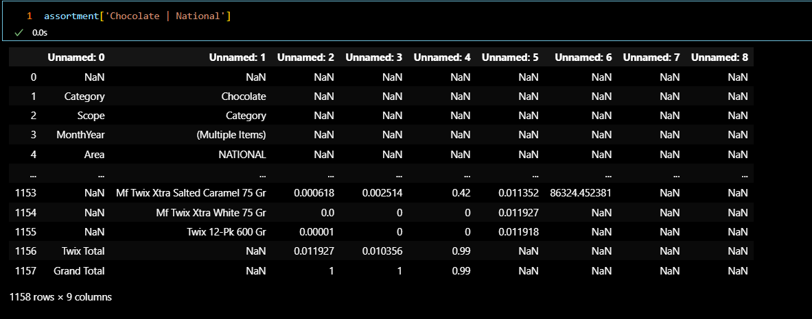

---

###### cleaning Code

- [mixAssortmentCleaning function](https://github.com/khaledSeifEleslam/Slide-Automate/blob/main/Assortment%20Slide%20Duplicate/Assortment%20Duplicate.ipynb): Cleans and processes assortment and cumulative share data to provide modified data for brand-specific analysis.
  - Args:
    assortment (dict): Dictionary containing assortment data.
    cumulativeShare (dict): Dictionary containing cumulative share data.
  - Returns:
    tuple:
    - assortmentModifiedBrand (dict): Dictionary containing cleaned and modified assortment data for brands.
    - assortmentModifiedTotal (dict): Dictionary containing cleaned and modified total assortment data.
    - assortmentClient (dict): Dictionary containing client-specific cleaned and modified assortment data.

```python
def mixAssortmentCleaning(assortment, cumulativeShare):
    # Initialize dictionaries to store modified data
    cumulativeShareModifiedBrand = {}
    assortmentModified = {}
    assortmentModifiedBrand = {}
    assortmentModifiedTotal = {}
    assortmentClient = {}
    # Process cumulative share data
    for key, value in cumulativeShare.items():
        dfcumulative = value.iloc[11:].reset_index(drop=True)  # Adjust the dataframe to remove unnecessary rows
        dfcumulative.columns = dfcumulative.iloc[0]  # Set the first row as the column headers
        dfcumulative = dfcumulative.iloc[1:]  # Remove the row used for headers
        if dfcumulative.shape[0] != 0:  # If the dataframe is not empty
            newKey = key
            if key.split(' | ')[0] not in categories:  # Adjust key if it does not match category format
                newKey = key.split(' | ')[1] + ' | ' + key.split(' | ')[0]
            cumulativeShareModifiedBrand[newKey] = dfcumulative.replace(np.nan, 0)  # 
    # Process assortment data
    for key, value in assortment.items():
        df = value.iloc[12:].reset_index(drop=True)  # Adjust the dataframe to remove unnecessary rows
        df.columns = df.iloc[0]  # Set the first row as the column headers
        df = df.iloc[1:]  # Remove the row used for headers
        df['Top Brands'] = df['Top Brands'].ffill()  # Forward fill 'Top Brands' colum
        # Replace specific values in 'Top Brands' as per 'valueToReplace' dictionary
        for val, replacer in valueToReplace.items():
            df['Top Brands'] = df['Top Brands'].str.replace(val, replacer)
        dfBrand = df[~df['Top Brands'].str.contains('Total')]  # Filter out rows containing 'Total' in 'Top Brands'
        dfTotal = df[df['Top Brands'].str.contains('Total') & (df['Top Brands'] != 'Grand Total')].reset_index(drop=True)
        dfTotal['Top Brands'] = dfTotal['Top Brands'].str.replace(' Total', '')  # Adjust 'Top Brands' column for total rows
        if df.shape[0] != 0:  # If the dataframe is not empty
            newKey = key
            if key.split(' | ')[0] not in categories:  # Adjust key if it does not match category format
                newKey = key.split(' | ')[1] + ' | ' + key.split(' | ')[0]
            # Process client-specific data for each brand
            for brand in client_brands_competitor:
                if df[df['Top Brands'] == brand].shape[0] > 0:  # Check if brand data exists in dataframe
                    assortmentClient[newKey + ' | ' + brand] = df[df['Top Brands'] == brand].replace(np.nan, 0)
                    assortmentClient[newKey + ' | ' + brand] = assortmentClient[newKey + ' | ' + brand].merge(
                        cumulativeShareModifiedBrand[newKey], how='left', on='Product')
            # Store modified data for total, brand, and overall assortment
            assortmentModified[newKey] = df.replace(np.nan, 0)
            assortmentModifiedBrand[newKey] = dfBrand.replace(np.nan, 0).drop(columns=['Cumulative Product Share'])
            assortmentModifiedBrand[newKey] = assortmentModifiedBrand[newKey].merge(
                cumulativeShareModifiedBrand[newKey], how='left', on='Product')
            assortmentModifiedTotal[newKey] = dfTotal.replace(np.nan, 0)
    return assortmentModifiedBrand, assortmentModifiedTotal, assortmentClient
```

---

###### Calling function & data frame After cleaning

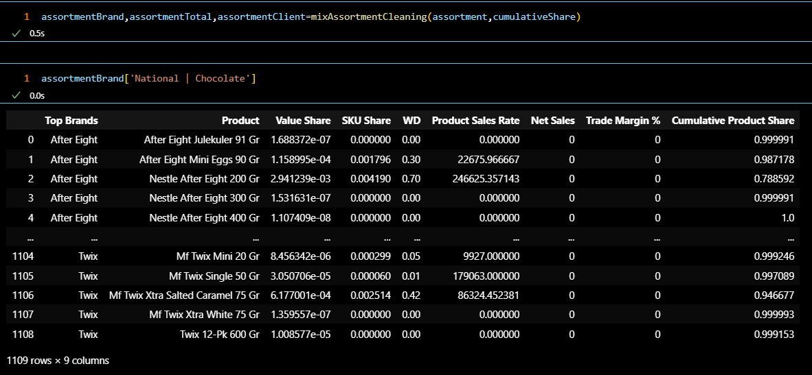

---

##### [Step 3: Write Functions to Create Slides](https://github.com/khaledSeifEleslam/Slide-Automate/blob/main/general_functions/Assortment%20Replacement%20Function.ipynb)

###### Example Slide : SKU Share By Brand

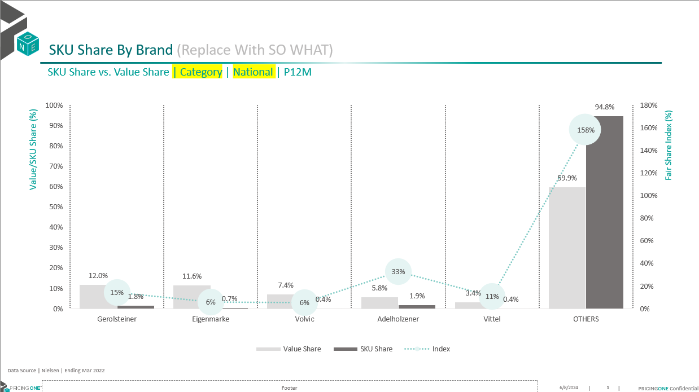

---

###### Replacement function

- [SkuShareByBrand function](https://github.com/khaledSeifEleslam/Slide-Automate/blob/main/general_functions/Assortment%20Replacement%20Function.ipynb):Updates PowerPoint slides with SKU and Value Share data by brand for a given market.
  - Args:
    prs (Presentation): The PowerPoint presentation object.
    assortmentTotalSorted (dict): Dictionary containing sorted assortment data by market.
    numOfDuplicates (int): Number of slides to duplicate and update.
    position (int, optional): Starting position for slide updates. Default is 0.

```python
def SkuShareByBrand(prs, assortmentTotalSorted, numOfDuplicates, position=0):
    for slidenum in range(numOfDuplicates):
        market = list(assortmentTotalSorted.keys())[slidenum]
        df = assortmentTotalSorted[market].copy()
  
        # Sort the dataframe by 'Value Share' in descending order
        df = df.sort_values('Value Share', ascending=False)
  
        # Ensure that 'Others' is the last row in the dataframe
        df = pd.concat([df[df['Top Brands'] != 'Others'], df[df['Top Brands'] == 'Others']]).reset_index(drop=True)
  
        # Get the shapes in the current slide
        shapes = prs.slides[slidenum + position].shapes
  
        # Update text in specific shapes
        shapes[4].text = data_source
        shapes[5].text = shapes[5].text.replace('National', market.split(' | ')[1]).replace('Category', market.split(' | ')[0])
  
        # Format the text in the shapes
        shapes[5].text_frame.paragraphs[0].font.size = Pt(12)
        shapes[5].text_frame.paragraphs[0].font.name = 'Nexa Bold (Headings)'
        shapes[6].text_frame.paragraphs[0].font.size = Pt(16)
        shapes[6].text_frame.paragraphs[0].font.name = 'Nexa Bold (Headings)'
  
        # Create tables and charts from the shapes
        tables, charts = createTableAndChart(shapes)
        chart = charts[0].chart
  
        # Prepare chart data
        chart_data = CategoryChartData()
        chart_data.categories = df['Top Brands'].tolist()
        chart_data.add_series('Value Share', df['Value Share'])
        chart_data.add_series('SKU Share', df['SKU Share'])
  
        # Calculate the index (SKU Share / Value Share) and handle division by zero
        chart_data.add_series('Index', df['SKU Share'] / df['Value Share'].replace(0, 1))
  
        # Replace the chart data with the prepared data
        chart.replace_data(chart_data)
```

---

##### [Step 4: Duplicate Slides](https://github.com/khaledSeifEleslam/Slide-Automate/blob/main/Assortment%20Slide%20Duplicate/Assortment%20Duplicate.ipynb)

###### [Duplicate Slides](https://github.com/khaledSeifEleslam/Slide-Automate/blob/main/Assortment%20Slide%20Duplicate/Assortment%20Duplicate.ipynb):

generate a PowerPoint presentation with multiple sections, each containing data visualizations and tables

```python
# Define the indexes for different sections of the presentation
index = [0,1,2,3 if len(client_brands)>0 else None ,4,5 if len(client_brands)>0 else None,6 if len(client_brands)>0 else None, *[7]*((1 if sectors else 0) + (1 if segments else 0) + (1 if subsegments else 0) + (1 if subcategories else 0)),0]
index = [x for x in index if x is not None]

duplication = [len(assortmentBrandSorted.keys()),len(assortmentBrand.keys()),len(cumulativeShareTop50.keys()), len(assortmentClient.keys()) if len(client_brands) >0 else None,len(assortmentBrand.keys()) , len(assortmentClientBrand.keys()) if len(client_brands)>0 else None , len(assortmentClientBrand.keys()) if len(client_brands)>0 else None,
               len(final_Sector.keys()) if len(sectors) >0 else None, len(final_Segment.keys()) if len(segments) > 0 else None, len(final_SubCategory.keys()) if len(subcategories) >0 else None, len(final_Subsegment.keys()) if len(subsegments) > 0 else None ,len(assortmentBrandNOTSorted.keys())]
duplication = [x for x in duplication if x is not None]

section_names = ["SKU Share By Brand","Cumulative Product Shares","Top 50% cumulative share","Brand Cumulative Product Share" if len(client_brands) >0 else None,"Top 20 cumulative share","SKU Productivity Analysis with TM%" if len(client_brands)>0 else None, "SKU Productivity Analysis with WD" if len(client_brands)>0  else None,
                 "Sectors Fair Share" if len(sectors) > 0 else None, "Segments Fair Share" if len(segments) > 0 else None, "SubCategory Fair Share" if len(subcategories) > 0 else None, "SubSegment Fair Share" if len(subsegments) > 0 else None,"SKU Share By Brand no client prio" ]
section_names = [x for x in section_names if x is not None]

path = os.getcwd() + '//Assortment base Oct 2024.pptx'
new_pre = os.getcwd() + '//slide duplicated1.pptx'


length = len(duplication)
for i in reversed(range(length)):
    if duplication[i]==0:
        del duplication[i]
        del index[i]
        del section_names[i]
```

---


###### [Duplication Function](https://github.com/khaledSeifEleslam/Slide-Automate/blob/main/general_functions/generalFunctions.ipynb)

We use the duplication function to duplicate slides by number of the duplicate  and save it in the duplication deck to use it to replace data.
Duplicate slides in a PowerPoint presentation.
    Parameters:
    - index (list): List of slide indices to duplicate.
    - duplication (list): List specifying the number of times each slide should be duplicated.
    - section_names (list): List of names for sections to be added.
    - path (str): Path to the PowerPoint presentation file.
    - new_pre (str): Path to save the duplicated presentation.
    Returns:
    - str: A message indicating success or failure.
```python
####New_With_duplicate
import pythoncom
defslideDuplication(index=[0,1],duplication=[1,1],section_names=[''],path='',new_pre=''):
    lis=[]
    iflen(index)!=len(duplication)!=len(section_names):
        return'The Index list not equal the Duplication number list in length'
    app = win32.Dispatch("PowerPoint.Application")
    presentation = app.Presentations.Open(path)
    # Iterate through the slides in the original presentation and copy them to the new presentation
    for i inrange(len(index)):
        iftype(index[i])==list:
            # If index is a list of slide indices
            for num_duplicate inrange(duplication[i]):
                for k in index[i]:
                    slide=presentation.Slides[k]
                    duplicated_slide = slide.Duplicate()
                    duplicated_slide.MoveTo(presentation.Slides.Count)
            lis.append(presentation.Slides.count+1-(duplication[i]*len(index[i])))
        else:
            # If index is a single slide index
            slide=presentation.Slides[index[i]]
            for num_duplicate inrange(duplication[i]):
                duplicated_slide = slide.Duplicate()
                duplicated_slide.MoveTo(presentation.Slides.Count)
            lis.append(presentation.Slides.count+1-duplication[i])
    # Add sections to the new presentation
    for j inrange(len(lis)):
        if duplication[j]!=0:
            presentation.SectionProperties.AddBeforeSlide(lis[j],section_names[j] )
    # presentation.ApplyTheme(themePath)
    presentation.SectionProperties.Delete(1, True)
    presentation.SaveAs(new_pre)
    presentation.Close()
    # Close the original presentation and PowerPoint application
    app.Quit()
```
##### [Step 5: Replace Data in Slide](https://github.com/khaledSeifEleslam/Slide-Automate/blob/main/Assortment%20Slide%20Duplicate/Assortment%20Duplicate.ipynb)

- Generate the slides for SKU Share By Brand using the provided data.
  - prs: The PowerPoint presentation object where slides will be added or modified.
  - assortmentTotalSorted: The data set containing SKU share information, sorted accordingly.
  - duplication[0]: The number of duplicates to create for this section, specified by the first element in the duplication list.
  - position=0: The starting position for slide creation in this section.
  - ```python
    posItr = 0
    
    ind=0
    
    SkuShareByBrand(prs,assortmentBrandSorted,duplication[ind],position=posItr)
    
    posItr = posItr+len(assortmentBrandSorted)
    
    ind+=1
    ```

##### [Step 6: Save Presentation](https://github.com/khaledSeifEleslam/Slide-Automate/blob/main/Assortment%20Slide%20Duplicate/Assortment%20Duplicate.ipynb)

```python
# Set the output path for the PowerPoint presentation
outputPath = os.getcwd() + "\\Mix and assortment doc output.pptx"

# Save the current PowerPoint presentation to the specified path
prs.save(outputPath)

# Open the saved PowerPoint presentation using the PowerPoint application
app = win32.Dispatch("PowerPoint.Application")
presentation = app.Presentations.Open(outputPath)
```

---

###### Example: OutPut Slide

 After Replacement Data "SKU Share By Brand"

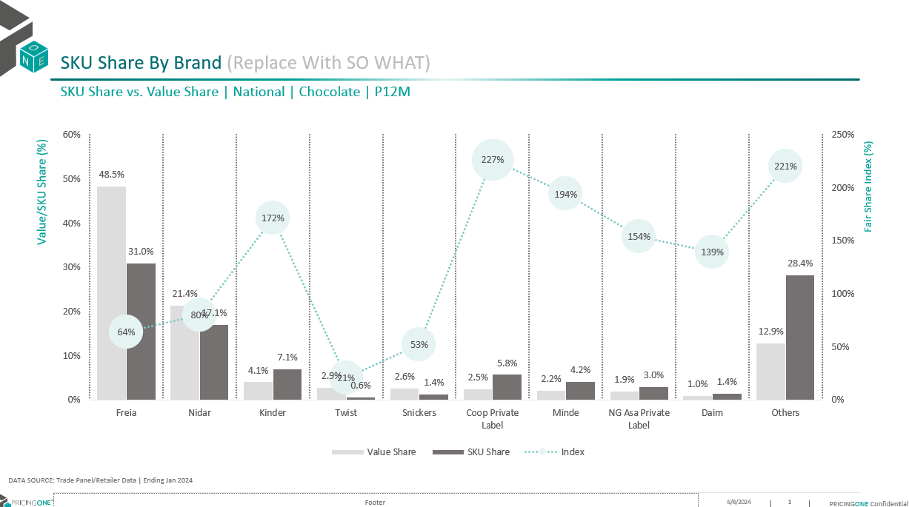

---

<div style="page-break-before: always;"></div>

### Promotion Section

#### Introduction

In the slide automation Promotion: using19 slide base we create deck


1-Promotion output slides:

* Promo Value Sales 
* Promo evolution 
* VSOD Summary by Sector 
* Value uplift by retailer by brand 
* Volume Uplift vs discount depth 
* Value Uplift vs Promo Efficiency Quadrant 
* Top 20 promotions 
* Bottom 20 promotions 
* Volume Sold on Deal 
* Promo share vs Value Share 
* Promo Sales by total size 
* Promo Sales by promo type 
* Feature Share vs. Fair Share 
* Display Share vs. Fair Share 
* Promo Frequency learnings 
* Promo sales per retailer 
* Value Uplift vs discount depth 
* Seasonality Index 
* Promotional Frequency Analysis 

---

#### Project Steps

- Project Flow
  

* [Step 1: Import Libraries we use](#step-1-import-libraries)
* [Step 2: modified Data frames: cleaning and preprocessing the data frames](#step-2-modified-data-frame)
* [Step 3: Write Functions to Create Slides: Define functions to dynamically generate slides based on the base slides](#step-3-write-functions-to-create-slide)
* [Step 4: Duplicate Slides: Use functions or methods to duplicate existing slides as needed for the presentation.](#step-4-duplicate-slides)
* [Step 5: Replace Data in Slide: update information from the cleaned data frames to slides](#step-5-replace-data-in-slide)
* [Step 6: Save Presentation](#step-6-save-presentation)

---

##### [Step 1: Import Libraries we use ](https://github.com/khaledSeifEleslam/Slide-Automate/blob/main/general_functions/generalFunctions.ipynb)

###### Ex: Libraries we use

- This script sets up an environment for working with PowerPoint presentations, data manipulation, filesystem operations, and COM (Component Object Model) object access.
- It imports necessary modules such as 'pptx' for PowerPoint automation, 'win32com' for COM object access and Windows automation, 'pandas' and 'numpy' for data manipulation,
- 'pathlib' for working with filesystem paths, 're' for regular expression operations, and various other modules for general-purpose tasks like file operations and timing functions.
- By importing these modules, the script prepares itself for tasks such as creating or modifying PowerPoint presentations, analyzing data using pandas and numpy, interacting
- with the Windows environment using win32com, and performing filesystem operations using shutil and os. Overall, this script provides a comprehensive setup for automating tasks
- related to PowerPoint presentations and general-purpose Python programming.

```python
# Import necessary module for working with PowerPoint presentations
from pptx import Presentation
# Import the win32com.client module, aliasing it as win32 for convenience
import win32com.client as win32
# Import pandas for data manipulation and analysis
import pandas as pd
# Import numpy for numerical computing
import numpy as np
# Import the Path class from pathlib for working with filesystem paths
from pathlib import Path
# Import re for regular expression operations
import re
# Import sys for access to interpreter-related functions
import sys
# Import time for various time-related functions
import time
# Assign win32.constants to a shorter alias win32c for easier access
win32c = win32.constants
# Import shutil for high-level file operations
import shutil
# Import os for operating system dependent functionality
import os
# Import win32com.client again for COM object and functions access
import win32com.client
# Import warnings for warning control functionality
import warnings
```

---

##### [Step 2: modified Data frame](https://github.com/khaledSeifEleslam/Slide-Automate/blob/main/Promotion%20Slide%20Duplicate/Promotion%20Duplicate.ipynb)

###### EX: input dataframes before cleaning

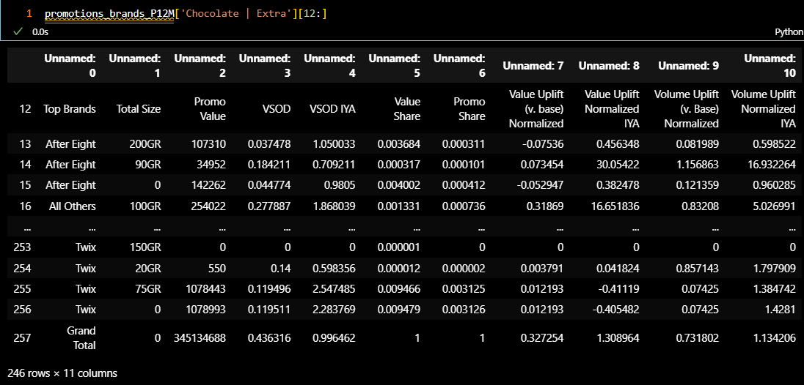

---

###### Cleaning Data Frame

- [cleaningData function](https://github.com/khaledSeifEleslam/Slide-Automate/blob/main/Promotion%20Slide%20Duplicate/Promotion%20Duplicate.ipynb): Clean and preprocess data in a dictionary of DataFrames.
  - Parameters:
    data (dict): Dictionary containing DataFrames.
  - Returns:
    dict: Dictionary containing cleaned DataFrames.

```python
def cleaningData(data):
    cleaned_data = {}
    # Iterate over each key-value pair in the input dictionary
    for key in data:
        # Skip the first 11 rows if there are NaN values
        df = data[key].iloc[11:]
        if data[key].iloc[11,:].isna().any():
            df = data[key].iloc[12:]
        # Set column names and skip the first row
        df.columns = df.iloc[0]
        df = df.iloc[1:]
        # Perform specific cleaning operations based on the DataFrame columns and key
        if df.shape[0] > 0 and not 'National' in key:
            if 'Top Brands' in df.columns and 'Product' in df.columns:
                df['Top Brands'] = df['Top Brands'].fillna(method='ffill')
                df['Product'].fillna('', inplace=True)
                df.fillna(0, inplace=True)
                df['Top Brands'] = df['Top Brands'].apply(lambda x: 'Grand Total' if 'Grand Total' in x else x.replace('Total', '').strip())
            elif 'Top Brands' in df.columns:
                df['Top Brands'] = df['Top Brands'].fillna(method='ffill')
                df.fillna(0, inplace=True)
                df['Top Brands'] = df['Top Brands'].apply(lambda x: 'Grand Total' if 'Grand Total' in x else x.replace('Total', '').strip())
                df = df[~df['Top Brands'].str.contains('Total', case=False)]
                df = df[df['Total Size'] == 0].reset_index(drop=True)
                df['VSOD Evaluation vs YA']=df['VSOD IYA']-1
                df['Promo Value Uplift vs YA']=df['Value Uplift Normalized IYA']-1

            elif 'End of Week' in df.columns and 'Product' in df.columns:
                df['Product'] = df['Product'].fillna(method='ffill')
                df = df[(df['End of Week'].str.contains('2023|2024')) & (df['End of Week'].notna())]
                df['End of Week'] = pd.to_datetime(df['End of Week'])
                df = df[(df['End of Week'] >= start_date) & (df['End of Week'] <= end_date)]
                df = df[~df['Product'].str.contains('Total', case=False)].reset_index(drop=True)
                df = df[df['Promo Sales'] > 10000]
                df = df.dropna(subset=['Value Uplift (v. base) Normalized'])
                df.fillna(0, inplace=True)
                df = df.reset_index(drop=True)
    
            elif 'End of Week' in df.columns:
                df['End of Week'] = df['End of Week'].astype(str)
                df = df[~df['End of Week'].str.contains('Total', case=False)].reset_index(drop=True)
                df['End of Week'] = pd.to_datetime(df['End of Week'])
                df['End of Week'] = df['End of Week'].dt.strftime("%d-%b-%y")
                df = df[(df['End of Week'].str.contains('-21|-22|-23|Jan-24')) & (df['End of Week'].notna())]
                df['End of Week'] = pd.to_datetime(df['End of Week'])
                df = df[(df['End of Week'] >= start_date) & (df['End of Week'] <= end_date)]
                df = df.dropna()
    
            elif 'Grand Total' in df.columns:
                df.fillna(0, inplace=True)
            # Check if the key matches specific categories and modify the key accordingly
            if key.split(' | ')[0] in categories and len(key.split(' | ')) == 3:
                modified_key = key.split(' | ')[1] + ' | ' + key.split(' | ')[2] + ' | ' + key.split(' | ')[0]
                if df.shape[0] > 0:
                    cleaned_data[modified_key] = df
            else:
                if df.shape[0] > 0:
                    cleaned_data[key] = df
    return cleaned_data
```

---

###### Example: out put data frame after cleaning

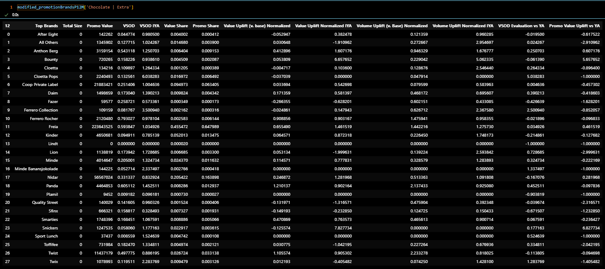

---

##### [Step 3: Write Functions to Create Slides](https://github.com/khaledSeifEleslam/Slide-Automate/blob/main/Promotion%20Slide%20Duplicate/Promotion%20Duplicate.ipynb)

###### Example slide : Promo Value Sales base slide

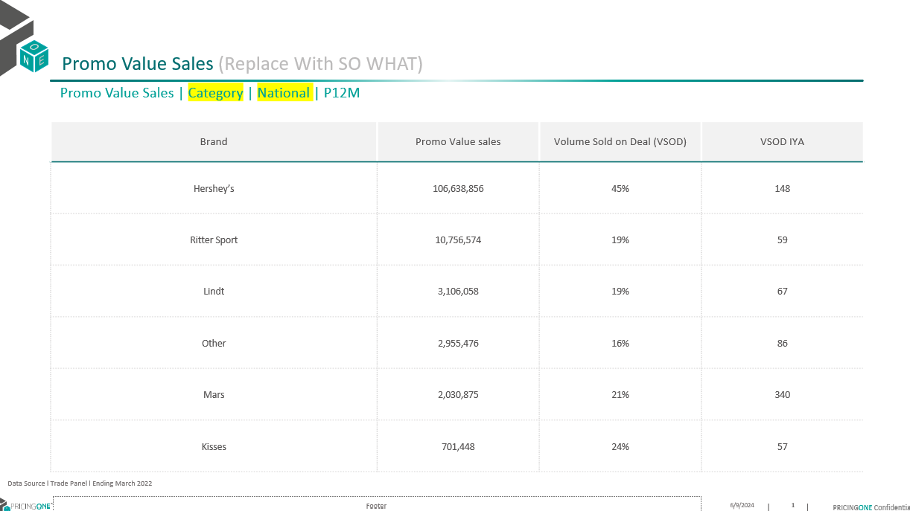

---

###### Replacement function

- [promoValueSales function]():Generate PowerPoint slides for promo value sales

```python
def promoValueSales(prs, promotionsBrandDF, numOfDuplicates, position=0):
    # Loop through each slide number
    for slidenum in range(numOfDuplicates):
        # Get market from promotionsBrandDF keys
        market = list(promotionsBrandDF.keys())[slidenum]
        # Retrieve DataFrame for the current market
        df = promotionsBrandDF[market].reset_index(drop=True)
        # Remove rows with 'Others' in 'Top Brands' column and filter by 'Value Share'
        df = df[~df['Top Brands'].str.contains('Others', case=False)]
        df = df[df['Value Share'] > 0.01]
        # Select client brands
        df_client = selectClientBrands(promotionsBrandDF[market],'Top Brands', 'Promo Value')
        number_of_brands_needed = 5 - len(df_client)
        # Filter top brands and concatenate with client brands
        df = df[~df['Top Brands'].isin(client_brands)]
        df = df.sort_values(by='Promo Value', ascending=False).head(number_of_brands_needed)
        df = pd.concat([df, df_client], ignore_index=True)
        df = df.sort_values(by='Promo Value', ascending=False)
        # Update title
        shapes = prs.slides[slidenum + position].shapes
        titlNumber = get_shape_number(shapes, "Promo Value Sales | Category | National | P12M")
        shapes[titlNumber - 1].text = data_source
        shapes[titlNumber + 1].text_frame.paragraphs[0].font.size = Pt(16)
        shapes[titlNumber + 1].text_frame.paragraphs[0].font.name = 'Nexa Bold (Headings)'
        shapes[titlNumber].text = shapes[titlNumber].text.replace('Category', market.split(' | ')[0]).replace(
            'National', market.split(' | ')[1])
        shapes[titlNumber].text_frame.paragraphs[0].font.size = Pt(12)
        shapes[titlNumber].text_frame.paragraphs[0].font.name = 'Nexa Bold (Headings)'
        # Create table and chart
        tables, charts = createTableAndChart(shapes)
        table = tables[0].table
  
        # Remove unnecessary rows
        num_rows_to_remove = len(table.rows) - df['Top Brands'].nunique() - 1
        table_height = get_table_height(table)
        for _ in range(num_rows_to_remove):
            if len(table.rows) > 1:
                row = table.rows[1]
                remove_row(table, row)
  
        # Adjust row heights
        total_row_height = table_height - table.rows[0].height
        num_rows = len(table.rows) - 1
        if num_rows > 0:
            cell_height = total_row_height / num_rows
            for row in range(1, table.rows.__len__()):
                table.rows[row].height = int(cell_height)
        # Populate table cells
        for i, row in enumerate(table.rows):
            for j, cell in enumerate(row.cells):
                if i == 0:  # Header row
                    continue
                if j == 0:  # Brand column
                    cell.text = df['Top Brands'].iloc[i - 1]
                    cell.text_frame.paragraphs[0].font.name = 'Nexa Bold'
                elif j == 1:  # Promo Value sales column
                    value = df['Promo Value'].iloc[i - 1]
                    if len(str(value)) > 3:
                        formatted_value = '{:,}'.format(int(value))
                        cell.text = str(formatted_value)
                        cell.text_frame.paragraphs[0].font.name = 'Nexa Book'
                    else:
                        cell.text = str(df['Promo Value'].iloc[i - 1])
                        cell.text_frame.paragraphs[0].font.name = 'Nexa Book'
                elif j == 2:  # Volume Sold on Deal (VSOD) column
                    cell.text = str(int(round(df['VSOD'].replace(np.nan, 0).iloc[i - 1] * 100, 0))) + '%'
                    cell.text_frame.paragraphs[0].font.name = 'Nexa Book'
                else:  # VSOD IYA column
                    cell.text = str(int(round(df['VSOD IYA'].replace(np.nan, 0).iloc[i - 1] * 100, 0)))
                    cell.text_frame.paragraphs[0].font.name = 'Nexa Book'
                # Set font size and alignment
                cell.text_frame.paragraphs[0].font.size = Pt(8)
                cell.text_frame.paragraphs[0].alignment = PP_ALIGN.CENTER
```

---

##### [Step 4: Duplicate Slides](https://github.com/khaledSeifEleslam/Slide-Automate/blob/main/general_functions/Promotion%20Replacement%20Function.ipynb):

- This code generates indices, duplication factors, and section names for PowerPoint slides
- based on different promotional data sources. It sets up paths for the base and duplicated slides,
- and ensures the correct indices and duplication values for each section of the presentation.

```python
# Generate indices for slides containing promo value data for different categories, sectors, and segments
slidePromoValueIndex = [
    [i + 15 for i in catDuplication.values()],  # Adjust category duplication indices by adding 15
    [i + 15 for i in secDuplication.values()],  # Adjust sector duplication indices by adding 15
    [i + 15 for i in segDuplication.values()]   # Adjust segment duplication indices by adding 15
]
# Create a list of slide indices, conditional on the presence of promo type, feature share, and display share data
index = [
    0, 1, 2, 3, 4, 5, 6, 7, 8, 9, 10, 11, 
    12 if promo_type != False else None,  # Conditional index for promo type
    13 if feature_share != False else None,  # Conditional index for feature share
    14 if display_share != False else None,  # Conditional index for display share
    15, *slidePromoValueIndex, 20  # Base index 15, adjusted promo value indices, and final index 20
]
# Remove None values from the index list
index = [x for x in index if x is not None]
# Calculate the lengths of various datasets
len_brands = len(modified_promotionBrandsP12M)
len_Prod = len(modified_promotionProductsP12M)
len_modified_prod = len(new_modified_promotionProductsP12M)
len_client_market = len(client_brands) * len(regions_RET)
# Define duplication factors for each section based on the lengths of relevant datasets
duplication = [
    len_brands, len(promotionsBrandSortedTotal), len(promotionsBrandsWithMarket), len(concated), 
    len_Prod, len_modified_prod, len_modified_prod, len(top20clientonly), len(bottom20clientonly),
    len_client_market, len_brands, len(newModifiedBrands), 
    len(newModifiedBrands) if promo_type != False else None,  # Conditional duplication factor for promo type
    len_brands if feature_share != False else None,  # Conditional duplication factor for feature share
    len_brands if display_share != False else None,  # Conditional duplication factor for display share
    len(modified_promotionEndOfWeek), 1, 1,
    1 if len(segments) > 0 else None,  # Conditional duplication factor for segments
    len(modified_valueUplift)
]

# Remove None values from the duplication list
duplication = [x for x in duplication if x is not None]

# Define section names for each part of the presentation
section_names = [
    "Promo Value Sales", "Promo Evolution", "VSOD Summary", "Value uplift by retailer by brand",
    "Volume Uplift vs discount depth", "Value Uplift vs Promo Efficiency Quadrant", "Top 20 promotions",
    "Top 20 promotions CLIENT ONLY", "Bottom 20 promotions CLIENT ONLY", "Volume Sold on Deal",
    "Promo share vs Value Share", "Promo Sales by total size",
    "Promo Sales by promo type" if promo_type != False else None,  # Conditional section name for promo type
    "Feature Share vs Fair Share" if feature_share != False else None,  # Conditional section name for feature share
    "Display Share vs Fair Share" if display_share != False else None,  # Conditional section name for display share
    "Promo Frequency learnings", "Category Promo sales per retailer", "Sector Promo sales per retailer",
    "Segment Promo sales per retailer" if len(segments) > 0 else None,  # Conditional section name for segments
    "Value Uplift vs discount depth"
]
# Remove None values from the section names list
section_names = [x for x in section_names if x is not None]

# Define paths for the base PowerPoint file and the duplicated PowerPoint file
path = os.getcwd() + '//slide base.pptx'
new_pre = os.getcwd() + '//slide duplicated.pptx'

# Define the data source string to be used in the presentation
data_source = "DATA SOURCE: Trade Panel/Retailer Data | Ending Jan 2024"
```

---
###### [Duplication Function](https://github.com/khaledSeifEleslam/Slide-Automate/blob/main/general_functions/generalFunctions.ipynb)

We use the duplication function to duplicate slides by number of the duplicate  and save it in the duplication deck to use it to replace data.
Duplicate slides in a PowerPoint presentation.
    Parameters:
    - index (list): List of slide indices to duplicate.
    - duplication (list): List specifying the number of times each slide should be duplicated.
    - section_names (list): List of names for sections to be added.
    - path (str): Path to the PowerPoint presentation file.
    - new_pre (str): Path to save the duplicated presentation.
    Returns:
    - str: A message indicating success or failure.
```python
####New_With_duplicate
import pythoncom
defslideDuplication(index=[0,1],duplication=[1,1],section_names=[''],path='',new_pre=''):
    lis=[]
    iflen(index)!=len(duplication)!=len(section_names):
        return'The Index list not equal the Duplication number list in length'
    app = win32.Dispatch("PowerPoint.Application")
    presentation = app.Presentations.Open(path)
    # Iterate through the slides in the original presentation and copy them to the new presentation
    for i inrange(len(index)):
        iftype(index[i])==list:
            # If index is a list of slide indices
            for num_duplicate inrange(duplication[i]):
                for k in index[i]:
                    slide=presentation.Slides[k]
                    duplicated_slide = slide.Duplicate()
                    duplicated_slide.MoveTo(presentation.Slides.Count)
            lis.append(presentation.Slides.count+1-(duplication[i]*len(index[i])))
        else:
            # If index is a single slide index
            slide=presentation.Slides[index[i]]
            for num_duplicate inrange(duplication[i]):
                duplicated_slide = slide.Duplicate()
                duplicated_slide.MoveTo(presentation.Slides.Count)
            lis.append(presentation.Slides.count+1-duplication[i])
    # Add sections to the new presentation
    for j inrange(len(lis)):
        if duplication[j]!=0:
            presentation.SectionProperties.AddBeforeSlide(lis[j],section_names[j] )
    # presentation.ApplyTheme(themePath)
    presentation.SectionProperties.Delete(1, True)
    presentation.SaveAs(new_pre)
    presentation.Close()
    # Close the original presentation and PowerPoint application
    app.Quit()
```
---
##### [Step 5: Replace Data in Slides](https://github.com/khaledSeifEleslam/Slide-Automate/blob/main/general_functions/Promotion%20Replacement%20Function.ipynb)

- Call the promoValueSales function to generate slides for promotional value sales
- prs: PowerPoint presentation object
- modified_promotionBrandsP12M: Dictionary containing promotion data for different markets
- duplication[posItr]: Number of slides to duplicate for the current market
- position=posItr: Starting position to add slides in the presentation

```python
promoValueSales(prs, modified_promotionBrandsP12M, duplication[posItr], position=posItr)

# Increment the position iterator by 1 to move to the next section for the next function call
posItr += 1
```

##### [Step 6: Save Presentation](https://github.com/khaledSeifEleslam/Slide-Automate/blob/main/general_functions/Promotion%20Replacement%20Function.ipynb)

- performs two main tasks: saving the current PowerPoint presentation to a file and opening that file using the PowerPoint application. The outputPath variable is constructed using the current working directory, ensuring the presentation is saved in the correct location. After saving the presentation, the script uses win32com.client to dispatch the PowerPoint application and open the saved presentation. This automation allows for seamless transition from generating the presentation to viewing or editing it in PowerPoint, streamlining the workflow for creating market analysis slides.

```python
# This script saves the generated PowerPoint presentation to a specified path
# and then opens the saved presentation using the PowerPoint application.

# Define the output path for the PowerPoint presentation
outputPath=os.getcwd() + "\\Promotion doc output.pptx"

# Save the PowerPoint presentation to the specified output path
prs.save(outputPath)

# Initialize the PowerPoint application using win32com client
app = win32.Dispatch("PowerPoint.Application")

# Open the saved PowerPoint presentation
presentation = app.Presentations.Open(outputPath)
```

---

###### Example slide : Promo Value Sales slide after replacement

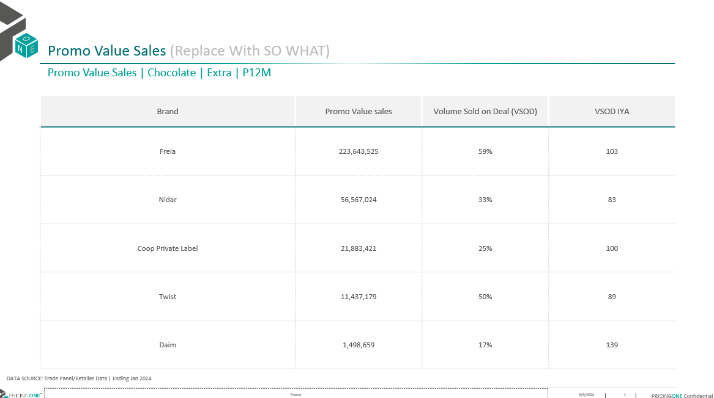
